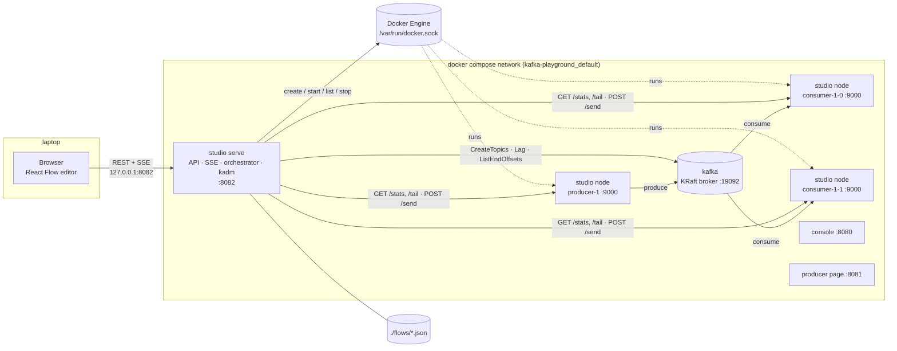
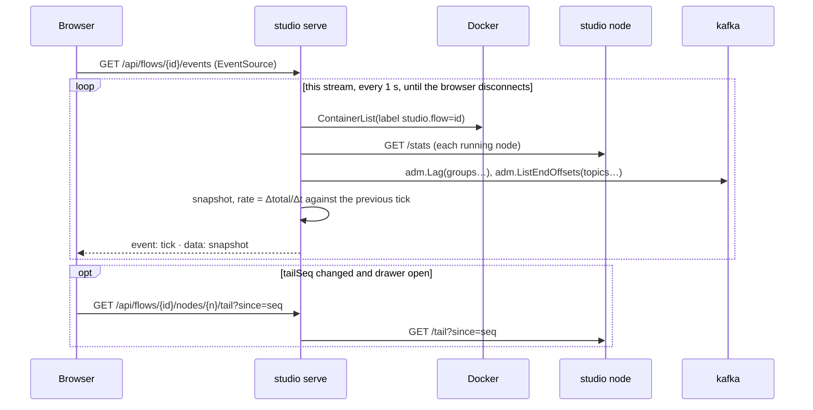
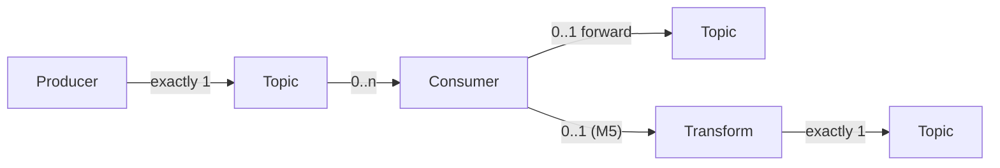

# Pipeline Studio — design

Date: 2026-10-06. Status: approved in conversation; the implementation plans
follow in `docs/superpowers/plans/`. M1–M3 shipped; M4, M5 and the new M6
were detailed on 2026-10-07 (section 7).

A Node-RED/n8n-style web app inside this playground: drag Producer, Topic and
Consumer nodes (later Transform) onto a canvas, wire them, save the flow as
JSON, deploy it with one click into real Kafka producers and consumers against
the playground broker, watch per-node msg/s, consumer lag, errors and a tail of
recent messages, stop it. Several flows run at once on the one broker.

## 1. Goal and scope

Purpose (stated by the user): a **learning / demo sandbox**. Single user,
laptop, throwaway data. Every size decision below follows from that.

Success criteria:

- `make up` starts the studio next to the existing stack; nothing uses a
  `latest` tag; every port binds to `127.0.0.1`.
- The editor only creates valid edges (Producer → Topic, Topic → Consumer,
  Consumer → Topic, later Consumer → Transform → Topic) and rejects the rest.
- A flow saved from the editor is a JSON file under `./flows/` that reloads
  byte-for-byte equivalent after a page refresh or a restart.
- Deploy creates the flow's topics (idempotent) and starts one container per
  producer/consumer node; the containers are visible in `docker ps`; Stop
  removes them.
- While deployed, the browser shows per node: state, messages/s, total,
  errors, consumer lag (consumers) and a tail of the last records; it updates
  every second without reloading.
- Two flows deployed at the same time, sharing a topic name, both work.
- `make verify` still ends with `VERIFY OK` and now also covers a studio flow
  end to end.

Non-goals: auth, TLS, multi-broker, schema registry, exactly-once, Kafka data
surviving `make down`, anything production-shaped.

## 2. Prior art: extend or build?

Checked on 2026-10-06 (web search + project pages; details and URLs in the
research notes at the end). The question: does anything combine a drag-wire
canvas, real Kafka producers/consumers, idempotent topic creation **and** live
per-node msg/s + consumer lag + message tail?

| Candidate | Language / licence | Last release | Covers | Extend in Go/TS | Verdict |
|---|---|---|---|---|---|
| Node-RED 5.0.4 + `node-red-contrib-kafka-suite` 0.0.5 or `@yroshcha/node-red-contrib-kafka` 6.2.10 | JS / Apache-2.0 (+ MIT nodes) | Jul–Sep 2026 | canvas, produce/consume, `inject` = timer, `http in` = webhook, `function` = transform, `flows.json`; **no** typed edges, no Topic node, no msg/s, no lag | High: JS runtime, nodes must be JS | Closest match; the hard part (stats, lag, tail) would still be written from scratch, in JS |
| n8n 2.42.3 (Kafka + Kafka Trigger) | TS / Sustainable Use License | Oct 2026 | produce/consume; no topic create, no lag, no streaming stats | High; SUL forbids redistribution | No |
| Apache StreamPipes 0.98.0 | Java + Angular / Apache-2.0 | Dec 2025 | canvas, Kafka adapter/sink, per-element monitoring, live preview; **no lag**, no topic create | High: Java backend, IIoT stack | No |
| Redpanda Connect visual composer | cloud UI (preview Jul 2026) | — | generates YAML only; not self-hostable | — | No |
| Apache NiFi 2.11.0, Apache Hop 2.19.0, Kestra 1.3.34, Conduit 0.19.0 | Java / Go | 2026 | batch/connector shaped; no per-node lag; Conduit has no UI | High | No |
| Kafka UIs: Kafbat 1.5.0, AKHQ 0.28.0, Redpanda Console (already in the stack), Conduktor/Lenses/Kpow CE | mixed | 2026 | lag, topics, browse, produce; **no canvas, no deploy** | — | Complement, not base |
| Go-RED (GitHub, untagged) | Go + React / MIT | Sep 2026, 0 stars | Node-RED clone in one Go binary, no Kafka | Reference only | No |

**Verdict: build new.** The canvas is a commodity (React Flow); the part that
matters — real producers/consumers, topic creation, msg/s, lag, tail — exists
nowhere and must be written anyway. Node-RED would force JS; n8n's licence
blocks shipping; StreamPipes is a JVM/IIoT stack. Borrowed instead of forked:
Node-RED's "flows are a JSON file" model; React Flow's node/edge JSON shape as
the file format.

## 3. Architecture

### 3.1 Overview



Four parts:

| Part | Where | Does |
|---|---|---|
| Editor | browser, TypeScript | palette, canvas, edge validation, inspector forms, stats badges, tail drawer; talks to the API with `fetch` and `EventSource` |
| Control plane `studio serve` | one container, Go | serves the embedded UI and the REST API; stores flows as JSON files; validates; creates topics with `kadm`; starts/stops one container per node through the Docker socket; polls nodes and the broker once a second; streams snapshots over SSE |
| Node runner `studio node` | one container per producer/consumer instance, same image, Go | runs exactly one `kgo.Client`; exposes `/stats`, `/tail`, `/send` on `:9000` to the control plane only |
| Broker and friends | existing compose services | unchanged |

### 3.2 Frontend

Vite + React + TypeScript, `@xyflow/react` for the canvas, Zod to check flow
JSON on load. Three panes: flow list (left), canvas (centre), inspector
(right) with the selected node's config form; a bottom drawer shows the tail
of the selected node. Custom node components render the type's badge, a
one-line summary of its config and, when deployed, `state · rate · lag ·
errors` from the latest SSE snapshot.

Edge validation in the browser is one lookup table used by React Flow's
`isValidConnection`; the backend re-validates on save and deploy and is the
authority (section 4.3).

Files, ~600 lines:

```
studio/ui/src/
  main.tsx, App.tsx          layout, flow selection, deploy/stop buttons
  flow/schema.ts             Zod schema + allowed-edge table (mirrors Go)
  flow/api.ts                fetch wrappers; useEvents(flowId) over EventSource
  nodes/StudioNodes.tsx      one shared frame for every node type; handles follow the edge table
  Palette.tsx, Inspector.tsx, TailDrawer.tsx
```

### 3.3 Backend API (control plane)

Go 1.27 standard library only: `net/http` `ServeMux` with method + wildcard
patterns, `embed` + `http.FileServerFS` for the UI, `encoding/json`, `os`.

| Method and path | Does | Errors |
|---|---|---|
| `GET /api/health` | `{"docker":"<engine version>","kafka":true}`; used by the container healthcheck (`studio -healthcheck`) | 503 if Docker or the broker is unreachable |
| `GET /api/flows` | `[{id, name, status}]`, status from the runtime (`stopped` / `running`) | |
| `POST /api/flows` | create from a body without `id`; returns the flow with its new 8-hex `id` | 422 on validation |
| `GET /api/flows/{id}` | the flow file | 404 |
| `PUT /api/flows/{id}` | save (allowed while running; the UI shows "redeploy to apply") | 422 |
| `DELETE /api/flows/{id}` | stop if running, delete the file | 404 |
| `POST /api/flows/{id}/deploy` | validate → create topics → start containers | 422 `{errors:[{node, message}]}`, 409 already running, 502 Docker/Kafka failure (after rollback) |
| `POST /api/flows/{id}/stop` | stop + remove the flow's containers | 404, 409 not running |
| `POST /api/flows/{id}/nodes/{node}/send?key=` | body = JSON value (key from `?key=`), or empty to render the node's own key and value templates with the next `.Seq` (the UI's Send button); proxied to the producer container's `/send`; returns `{partition, offset}`. The body form is the webhook URL | 400 invalid JSON, 409 not running, 502 |
| `GET /api/flows/{id}/nodes/{node}/tail?since=N&instance=I` | last ≤ 100 records with `seq > N`, proxied from the node; `instance` (M4, default 1) picks one of a consumer's instances; a node with one container is its own instance 1 | 409 |
| `GET /api/flows/{id}/state` | the flow's snapshot, as an SSE tick carries it but without rates: container states, each running node's counters, consumer lag and partitions, topic partitions and end offsets | 404 |
| `GET /api/flows/{id}/events` | SSE stream of `tick` snapshots (section 3.6) | 404 |

Request bodies are capped at 1 MiB (`http.MaxBytesReader`); every `/api`
response is JSON (an unknown path is 404, a known path with the wrong method
405); errors are `{"error": "..."}` as in `producer/main.go`. Everything
outside `/api` is the embedded UI.

Files, ~900 lines:

```
studio/
  main.go        roles: serve (default), node, -healthcheck; mux; embed ui/dist
  api.go         handlers above
  flow.go        types, Validate(), edge rules, node-id and topic-name rules
  store.go       JSON files: list, read, write via temp file + os.Rename
  resolve.go     flow → topics and one NodeSpec per container; what this milestone cannot run yet
  kafka.go       idempotent topic creation
  engine.go      Deploy/Stop/Reconcile; Snapshot; per-stream rates
  docker.go      thin wrapper over moby client: self-inspect, create, start, list, stop, remove
  node.go        `studio node`: producer and consumer loops; /stats /tail /send
  flow_test.go   table test for Validate
  store_test.go, api_test.go, resolve_test.go, kafka_test.go, node_test.go   everything that runs without Docker or a broker
  ui/            Vite project
  Dockerfile     node → golang:1.27.1-alpine → scratch
```

### 3.4 Flow runtime: one container per node

**Chosen: B, one container per producer/consumer instance**, all from the
studio image, orchestrated by the control plane through the Docker Engine API.

Alternatives weighed:

- **A. Goroutine per node inside the control plane.** Smallest code (~800
  lines), instant deploy, no Docker socket. Rejected by the user for this
  sandbox: nodes are invisible outside the app, and the playground's teaching
  model is "one container per consumer, `docker ps`, kill one, watch the
  rebalance".
- **C. One process per flow** (`os/exec` of the same binary). Crash
  isolation per flow but neither A's simplicity nor B's visibility.

Why B fits a learning sandbox:

- Every node is a container: `docker ps`, `docker logs`, `docker rm -f` work
  on it, and `make nodes` lists them. Killing one consumer instance shows a
  real rebalance in the UI and in `make groups`.
- Nodes outlive the control plane. `docker compose restart studio` keeps
  flows running; on start the control plane **reconciles** from container
  labels.
- Consumer `instances: N` is N identical containers in one group — the
  playground's `make scale` as a node property.

How it works:

- **Image and network discovery.** The control plane inspects its own
  container (hostname = container id) and reuses its image reference and
  network name for every node container. Fallback env `STUDIO_IMAGE` and
  `STUDIO_NETWORK` if that ever fails.
- **Node config.** The control plane resolves the graph into a flat per-node
  JSON in env `STUDIO_NODE` (`flow`, `node`, `instance`, `type`, the topic to
  produce to or consume from, the topic to forward to, the transform program,
  the node's `data`). The node binary never sees the graph.
- **Containers.** Name `studio-<flow>-<node>` (`-<i>` suffix when
  `instances > 1`), labels `studio.flow=<id>` and `studio.node=<id>`, env
  `KAFKA_BROKERS` copied from the control plane, command `["node"]`, no
  published ports, no restart policy (an exited node stays visible as
  `exited` until Stop), attached to the compose network so its name resolves.
- **Deploy** (sequence below): validate; `kadm.CreateTopics` for every Topic
  node, `kerr.TopicAlreadyExists` counts as success; create and start every
  producer/consumer container; on any failure stop and remove what was
  created and answer 502 with the Docker/Kafka error. A flow already running
  answers 409.
- **Stop:** `ContainerStop` (SIGTERM, 5 s grace so consumers commit and leave
  the group cleanly) then `ContainerRemove`, for every container with
  `studio.flow=<id>`. Topics and committed offsets are left alone.
- **Reconcile on start:** list containers with label `studio.flow`; flows
  whose file exists become `running`; containers of unknown flows are removed.
- **Transform (M5) is not a container.** It is a step inside the upstream
  consumer's container (applied between receive and forward). The UI still
  shows it as its own node with its own counters, which the consumer reports
  under the transform's node id.

```mermaid
sequenceDiagram
  participant B as Browser
  participant S as studio serve
  participant K as kafka
  participant D as Docker Engine
  participant N as studio node (×n)
  B->>S: POST /api/flows/{id}/deploy
  S->>S: read file, Validate()
  S->>K: kadm.CreateTopics(topics…) (TopicAlreadyExists = ok)
  loop each producer / consumer × instances
    S->>D: ContainerCreate(image=self, network=self, env STUDIO_NODE, labels)
    S->>D: ContainerStart
  end
  S-->>B: 200 {status: running} (422 / 409 / 502 + rollback otherwise)
  N->>K: kgo.NewClient; produce loop or consumer-group poll loop
  N->>N: listen :9000 — /stats /tail /send
```

Inside a node container:

- **Producer:** one `kgo.Client`, `kgo.ClientID("studio-<flow>-<node>")`, no
  `AllowAutoTopicCreation`. `manual`: waits for `/send`. `timer`: a
  `time.Ticker` renders the `key` and `value` templates (`text/template`
  with `.Seq`, `.Now`, `.Rand`) and calls `Produce` with a callback that
  updates counters and the tail. `/send` is accepted in both modes.
- **Consumer:** one `kgo.Client` with `ConsumerGroup`, `ConsumeTopics`,
  `ConsumeResetOffset` and `AutoCommitMarks`; a `PollFetches` loop; per record:
  append to the tail, then the sink — `log` (each record also goes to the
  container's stdout, so `docker logs` shows it), `http` (POST the value with
  `Content-Type: application/json`, 5 s timeout, redirects not followed, any
  answer but 2xx counts as an error) — then the transform if any (M5), and if the
  node forwards, `ProduceSync` to that topic with the same key (through the same
  client, 10 s timeout). The sink and the forward are independent: a failed sink
  does not stop the forward. A failed sink, transform or forward counts as an
  error and is not retried. Once handled, the record is marked, and only marked
  records are committed (autocommit of marks): a failed forward is still marked,
  so that record is lost to the next topic (at-most-once for forwards), except
  when it failed because the client was closing, which leaves it unmarked and
  redelivered. The image carries a CA bundle from M4 so `https` sinks work. On
  SIGTERM the node finishes the batch in hand (up to 3 s of the 5 s stop
  grace), commits what is marked, and closes the client, which leaves the
  group. `docker rm -f` (SIGKILL) skips that, so unmarked and uncommitted
  records are redelivered — at-least-once, on purpose, worth a README line.
- **Stats:** counters count records where they pass — produced by a producer, fetched by a consumer — with fetch and produce errors and the last error; `/stats` returns `{boot, total, errors, lastError, tailSeq}` (from M5 also `steps: {<transform id>: {total, errors, lastError}}` on a consumer that runs a transform), where `boot` is random per process so a restarted container starts over visibly. `/tail?since=` returns records from a 100-entry ring buffer (values truncated to 4 KiB). The control plane adds the container state from Docker and lag and partitions from the broker. The HTTP server listens on `:9000` inside the compose network only.

### 3.5 State store

- **Flow definitions:** one file per flow, `/data/<id>.json`, bind-mounted
  from `./flows` so files are inspectable, diffable and survive `make down`;
  example flows ship in git. Writes go to a temp file then `os.Rename`.
- **Runtime state:** derived, never stored. Which flows run comes from
  Docker labels (reconcile); counters live in the node containers; the
  control plane keeps no snapshot between ticks; each SSE stream holds only its previous one, for rates.
- Rejected: SQLite (`modernc.org/sqlite` is pure Go and would work, but there
  is nothing to query), bbolt (a dependency for what `os.Rename` does),
  `mattn/go-sqlite3` (cgo, incompatible with the `scratch` image).

### 3.6 Live status to the browser: SSE

One `EventSource` per open flow on `GET /api/flows/{id}/events`. Each open stream runs its own loop: every second it takes a snapshot — `ContainerList` by label (container states), `GET /stats` on every running node container, `adm.Lag` for the flow's groups and `adm.ListEndOffsets` for its topics — computes `rate = Δtotal / Δt` against its previous snapshot (none when a node's `boot` changed), and sends it as a `tick`. The loop ends when `r.Context()` is done. One tab is one loop; a poller shared between streams is an optimisation for many viewers. A consumer node's `assigned` partitions come from the group description in `adm.Lag`, whose members carry the node's container name as their client id. From M4, a consumer with `instances` > 1 also carries `instances: [{instance, state, total, rate, errors, lastError, tailSeq, boot, assigned}]`, one entry per container; its node-level `total`, `rate` and `errors` are the sums, `lag` stays the group's, and its `state` is `running` only when every instance runs (otherwise the first instance's state that is not); its `lastError` is the first instance's that has one, prefixed `#<i>: `. From M5 a transform node carries its consumer's state (`missing` while no container reports it) and the counters the consumer reports for it under `steps`.

```
event: tick
data: {"status":"running","nodes":{
  "consumer-1":{"state":"running","total":118,"rate":1,"tailSeq":118,"boot":"3f9a0c1d","lag":2,"assigned":{"orders":[0,1,2]}},
  "producer-1":{"state":"running","total":120,"rate":1,"tailSeq":120,"boot":"a1b2c3d4"},
  "topic-1":{"state":"ready","partitions":3,"endOffset":120}}}
```

The tail is **not** pushed. The drawer fetches
`GET …/nodes/{node}/tail?since=<seq>` only when the node's `tailSeq` changed
and the drawer is open: at most one small request per second per open drawer,
whatever the message rate.

Why SSE and not WebSocket: all browser→server traffic is request/response
(`fetch`), `EventSource` reconnects by itself, a handler is a plain
`net/http` handler that cooperates with `Server.Shutdown` (hijacked
WebSocket connections do not), and no library is needed
(`http.ResponseController.Flush`). Why not polling: a 1 s `setInterval`
would work, but SSE is the same 20 lines on the server and gives one
connection instead of a request per second per pane.



### 3.7 Where auth attaches later

Nothing now. When needed: one middleware around the `/api/` prefix in
`main.go` (sessions or bearer tokens; the UI adds the header in
`flow/api.ts`); the SSE endpoint takes the token as a query parameter because
`EventSource` cannot set headers; `send` URLs used as webhooks get a per-node
secret in the path; the compose port binding leaves `127.0.0.1` only behind
a TLS-terminating reverse proxy. The Docker socket mount makes the control
plane root-equivalent on the host, so exposure beyond localhost is the first
thing to redesign (a separate orchestrator with a narrow API), not the last.
Browser writes from other origins are already refused (`http.CrossOriginProtection` around the mux, M2), because the API drives the Docker socket.

## 4. Flow data model

### 4.1 Shape

The file is React Flow's own JSON (`id`, `type`, `position`, `data` per node;
`id`, `source`, `target` per edge; `viewport`) plus `id` and `name`, so the
editor's `toObject()` round-trips with no mapping layer. The backend decodes
into typed structs (unknown React Flow fields such as `measured` or
`selected` are dropped on save) and validates `data` per `type`.

```json
{
  "id": "a1b2c3d4",
  "name": "orders demo",
  "nodes": [
    {
      "id": "producer-1",
      "type": "producer",
      "position": { "x": 40, "y": 160 },
      "data": {
        "source": "timer",
        "interval_ms": 1000,
        "key": "{{.Seq}}",
        "value": "{\"id\": {{.Seq}}, \"at\": \"{{.Now}}\"}"
      }
    },
    {
      "id": "topic-1",
      "type": "topic",
      "position": { "x": 340, "y": 160 },
      "data": { "name": "orders", "partitions": 3, "replication_factor": 1 }
    },
    {
      "id": "consumer-1",
      "type": "consumer",
      "position": { "x": 640, "y": 160 },
      "data": {
        "group": "orders-studio",
        "auto_offset_reset": "earliest",
        "instances": 2,
        "sink": { "kind": "log" }
      }
    },
    {
      "id": "topic-2",
      "type": "topic",
      "position": { "x": 940, "y": 160 },
      "data": { "name": "orders-archive", "partitions": 1, "replication_factor": 1 }
    }
  ],
  "edges": [
    { "id": "e1", "source": "producer-1", "target": "topic-1" },
    { "id": "e2", "source": "topic-1", "target": "consumer-1" },
    { "id": "e3", "source": "consumer-1", "target": "topic-2" }
  ],
  "viewport": { "x": 0, "y": 0, "zoom": 1 }
}
```

This flow: a timer produces keyed JSON to `orders` once a second; two
instances of group `orders-studio` share its three partitions, log every
record and forward it to `orders-archive`.

### 4.2 Per-type `data`

| Type | Field | From | Rule |
|---|---|---|---|
| producer | `source` | M2 | `manual` or `timer` (M3) |
| | `interval_ms` | M3 | timer only, integer ≥ 10 |
| | `key` | M2 | optional `text/template`; empty = keyless |
| | `value` | M2 | `text/template`; must parse, and rendered with `Seq=1` must be valid JSON (checked on deploy) |
| topic | `name` | M2 | `^[a-zA-Z0-9._-]{1,249}$`, not `.` or `..`, unique within the flow (shared across flows on purpose) |
| | `partitions` | M2 | integer ≥ 1 |
| | `replication_factor` | M2 | must be `1` (single broker; the message says so) |
| consumer | `group` | M2 | non-empty, ≤ 255 chars |
| | `auto_offset_reset` | M2 | `earliest` (default) or `latest` |
| | `sink` | M2 | `{"kind":"log"}` (M2) or `{"kind":"http","url":"…"}` (M4), `url` must parse with scheme `http` or `https` |
| | `instances` | M4 | integer 1–10; absent or 0 means 1 |
| transform | `expr` | M5 | an `expr-lang/expr` program over `msg` (the decoded JSON value) returning the new value, or `nil` to drop the record; must compile on deploy |

"From" is the milestone whose runtime first uses a field. Save accepts every
field from M1, so the editor shows and edits the ones it has a form for (the
timer interval, a transform's `expr`); the palette offers Transform from M5.

Template data for producers: `.Seq` (1-based counter), `.Now` (RFC 3339),
`.Rand` (0–999). Node ids match `^[a-z0-9][a-z0-9-]{0,30}$` because they
become part of container names; the editor generates `<type>-<n>`.

### 4.3 Edge rules



| Rule | Checked by |
|---|---|
| Allowed pairs: producer→topic, topic→consumer, consumer→topic, consumer→transform, transform→topic. Anything else is refused at drag time (`isValidConnection`) and on save (422). | browser + Go |
| producer: exactly one outgoing edge, none incoming | Go, deploy |
| consumer: exactly one incoming edge; at most one outgoing edge in total, to either a topic or a transform | Go, deploy |
| transform: exactly one incoming (from a consumer) and one outgoing (to a topic) | Go, deploy |
| topic: any number of edges; a topic feeding no consumer or fed by nothing is fine (warning in the UI, not an error) | Go, deploy |
| no cycle through forwards (a consumer forwarding, directly or through other consumers, back to a topic it reads from); the problem names the topic that consumer reads | Go, deploy |
| every container a deploy starts has a name of its own (a consumer `consumer-1` with two instances runs `…-consumer-1-2`, which a node `consumer-1-2` would also take) | Go, deploy |
| no self edges, no duplicate edges, every edge endpoint exists, every edge id present and unique | Go, save |

Save validates shape and edge pairs so a half-built flow can be saved;
deploy validates everything.

## 5. Technology choices

Every pick's documentation was pulled through Context7 on 2026-10-06; exact
versions were cross-checked on npm, pkg.go.dev, GitHub releases and Docker
Hub the same day. Alternatives marked † were not re-verified today.

| Area | Pick | Version | Alternatives considered | Why the pick |
|---|---|---|---|---|
| Canvas | `@xyflow/react` (React Flow) | 12.12.0, MIT | Rete.js 2 (rete 2.0.6 + 4 plugins, validation via editor pipes); Drawflow 0.0.60 (last publish Sep 2024, types external, no React bridge); LiteGraph 0.7.18 (Jan 2024) and `@comfyorg/litegraph` 0.17.2 (Canvas2D: a config form cannot live inside a node); JointJS `@joint/core` 4.3.3 (MPL-2.0; editor extras in the commercial `@joint/plus`); Svelte Flow 1.7.0 / Vue Flow 1.48.2 (same library, other frameworks) | One MIT package covers all of it: `nodeTypes` for custom React nodes, `Handle`, `isValidConnection`, controlled `useNodesState`/`useEdgesState`, `toObject()` for save, `screenToFlowPosition` for palette drag-and-drop, `MiniMap`/`Controls`/`Panel`/`NodeToolbar` |
| UI toolchain | Vite `react-ts` template, TypeScript, Zod | Vite 8.3.3 (needs Node ^20.19 or ≥ 22.12), Zod 4.6.5 | Valibot 1.5.0 (fine, smaller); no schema library | Standard scaffold; `server.proxy` forwards `/api` to the compose'd backend; Zod guards hand-edited flow files before they reach React Flow. Three runtime dependencies total |
| Kafka client | franz-go `kgo` + `kadm` | v1.22.1 / v1.19.0, BSD-3, pure Go | confluent-kafka-go† (cgo, breaks `scratch`); sarama† and segmentio/kafka-go† (no admin lag helper, not already in the repo) | Already pinned and used in `producer/`; `ConsumeResetOffset`, `Close()` leaves the group; `kadm.CreateTopics` surfaces `kerr.TopicAlreadyExists` per topic; `kadm.Lag` does DescribeGroups + FetchOffsets + ListEndOffsets in one call |
| Web framework | Go standard library `net/http` | Go 1.27.1 | chi v5.3.2 (zero deps, but adds nothing past Go 1.22's method + `{wildcard}` routing and lists open advisories); echo/gin† (dependency trees); `coder/websocket` v1.8.15 if WebSocket were needed; `gorilla/websocket` v1.5.3 (untagged since Jun 2024, open advisory) | `ServeMux` patterns, `r.PathValue`, `embed` + `FileServerFS`, `ResponseController.Flush` for SSE, `Server.Shutdown`: everything used is built in, matching `producer/main.go` |
| Storage | JSON files + `os.Rename` | stdlib | `modernc.org/sqlite` v1.60.1 (pure Go, works on `scratch`, nothing to query); `go.etcd.io/bbolt` v1.5.0; `mattn/go-sqlite3` v1.14.52 (cgo) | Flows are small documents the user wants to read and commit; zero dependencies |
| Container runtime | `github.com/moby/moby/client` | v0.6.1, Apache-2.0 | `github.com/docker/docker/client` v28.5.2+incompatible (legacy path, frozen); shelling out to `docker` (no CLI in `scratch`); compose `--scale` (cannot express per-flow dynamic services) | Current module; `ContainerCreate`/`ContainerStart`/`ContainerList`/`ContainerInspect`/`ContainerStop`/`ContainerRemove` are all the API needed |
| Push channel | SSE (`text/event-stream`) | stdlib + browser `EventSource` | WebSocket (`coder/websocket`); 1 s polling | Section 3.6 |
| Transform engine (M5) | `expr-lang/expr` | v1.17.8, MIT (pin ≥ 1.17.8: earlier versions have DoS advisories) | `goja` (pure-Go JavaScript, pseudo-version 2026-10-06; needs `vm.Interrupt` watchdog and sandbox care); `cel-go` v0.31.0 (protobuf dependency tree) | Type-checked, memory-safe, always terminates, one dependency; `expr.Compile(src, expr.Env(...))` at deploy, `expr.Run` per record. Switch to goja only if users must write JavaScript |
| Build | `golang:1.27.1-alpine` → `scratch`, `CGO_ENABLED=0`; UI stage `node:<exact 24.x LTS>-alpine` | Go 1.27.1 (2026-09-01) | — | Same shape as `producer/Dockerfile`; every pick above is pure Go. The Node tag is pinned at M1 (not verified today) |

### 5.1 What was checked (Context7 library ids and topics)

- `/websites/reactflow_dev`, `/xyflow/xyflow`: custom `nodeTypes` and `Handle`; `isValidConnection`/`onConnect`; `useNodesState`/`useEdgesState`; `toObject()` save/restore; sidebar drag-and-drop with `screenToFlowPosition`; `Panel`, `NodeToolbar`, `MiniMap`, `Controls`, `Background`; v12 package rename.
- `/websites/svelteflow_dev`, `/bcakmakoglu/vue-flow`, `/websites/vueflow_dev`, `/retejs/retejs.org`, `/jerosoler/drawflow`, `/jagenjo/litegraph.js`, `/comfy-org/litegraph.js`, `/websites/jointjs`: versions, licences, validation model, framework bindings.
- `/vitejs/vite`: `react-ts` template, Vite 8 Node requirement, `server.proxy`. `/colinhacks/zod`: Zod 4 `safeParse`. `/mdn/content`: `EventSource` auto-reconnect, GET-only.
- `/twmb/franz-go`: `kgo.NewClient` options (`ProduceSync`/`Produce`, `RecordPartitioner`, `AllowAutoTopicCreation`, `ClientID`, `Close`), consumer-group options and callbacks, `PollFetches`/`PollRecords`, `CommitRecords`/`DisableAutoCommit`, `LeaveGroupContext`, `WithHooks` + `HookProduceRecordUnbuffered`/`HookFetchRecordUnbuffered`; `kadm.CreateTopics`, `kerr.TopicAlreadyExists`, `ListTopics`, `Lag`, `CalculateGroupLag`, `ListEndOffsets`, `DescribeGroups`, `DeleteGroups`. Signatures confirmed with `go doc` against the pinned modules.
- `/golang/go`, `/websites/go_dev_doc`: `ServeMux` patterns and `PathValue`; `embed` + `FileServerFS`; `ResponseController.Flush`; `Request.Context` cancellation; `Server.Shutdown`.
- `/go-chi/docs`, `/coder/websocket`, `/gorilla/websocket`: routing comparison, WebSocket status.
- `/websites/pkg_go_dev_modernc_org_sqlite`, `/mattn/go-sqlite3`, `/etcd-io/bbolt`: cgo requirements.
- `/expr-lang/expr`, `/dop251/goja`, `/cel-expr/cel-go`: compile/run API, timeouts, dependencies.
- `/websites/pkg_go_dev_github_com_moby_moby_client`: module path, `client.New(client.FromEnv)`, `ContainerCreate`/`ContainerStart`.
- Versions and dates: npm registry (`npm view`), pkg.go.dev, GitHub releases, go.dev/doc/devel/release, Docker Hub tags for `library/golang`.

Other tools used for this plan: Context7 MCP (library documentation), web
search and fetch (prior-art survey, release pages, licences), `npm view` and
`go doc` (exact versions and signatures), Docker Hub tag listing (image
pins). No code was run against the broker.

## 6. Repository changes

```
studio/                      new; everything in section 3.3
flows/                       new; bind-mounted to /data; ships one example flow
docker-compose.yml           + service studio
Makefile                     + verify-studio, nodes; down removes node containers first
README.md                    + "Pipeline Studio" section
AGENTS.md                    + studio build/check commands, node-container rule
docs/superpowers/specs/      this file
```

Compose service (final shape; exact healthcheck flag per `producer`):

```yaml
  studio:
    build: ./studio
    image: kafka-playground/studio:0.1.0
    pull_policy: build
    depends_on: *after-kafka
    ports:
      - "127.0.0.1:8082:8082"
    volumes:
      - /var/run/docker.sock:/var/run/docker.sock
      - ./flows:/data
    environment:
      KAFKA_BROKERS: *bootstrap
    healthcheck:
      test: ["CMD", "/studio", "-healthcheck"]
      interval: 2s
      retries: 30
```

Node containers are not compose services; they carry `studio.flow` labels.
`make down` therefore runs `docker rm -f $(docker ps -aq -f label=studio.flow)`
before `docker compose down`, because the compose network cannot be removed
while they are attached. `make nodes` = `docker ps -a -f label=studio.flow`.

Dev loop: Go changes are an image rebuild (`make up`, cached layers; the
control plane needs the socket and container-name resolution, so it cannot
run with `go run .` on the host). UI changes: `cd studio/ui && npm run dev`
with the Vite proxy pointed at `http://localhost:8082`. Checks after every
change: `(cd studio && go vet ./... && gofmt -l .)`, `(cd studio/ui && npx
tsc --noEmit && npm run build)`, `docker compose config --quiet`, `make down
&& make verify`.

`//go:embed all:ui/dist` with a committed `ui/dist/.gitkeep` keeps `go vet`
working before the UI is built (`all:` includes dotfiles, so the directory is
never an empty match).

## 7. Milestones

Each milestone ends in a `make verify`-style check and a demo you can run.
The user's split is kept with two moves: the timer source moves up to M3
(msg/s is meaningless without it), and Transform moves out to its own M5
(it brings a dependency and is a nice-to-have). M6 hardens what M3 left
open; it runs last, by the user's choice, so M4 lands on M3's snapshot loop.

### M1 — Editor, save/load, Docker smoke. No Kafka client.

- `studio` service builds (three-stage Dockerfile) and passes its
  healthcheck; `GET /api/health` reports the Docker Engine version (proves
  the socket mount and the uid question, section 8). The `kafka` field
  arrives with the Kafka client in M2.
- Palette → canvas → wire; invalid edges refused while dragging; inspector
  forms for the three types; Save → `flows/<id>.json`; flow list; reload
  restores the flow; `PUT` with a bad edge answers 422.
- `Validate` lands complete (both levels, every rule in 4.2 and 4.3) and
  `flow_test.go` covers it; the API uses `Save`, M2's deploy uses `Deploy`.
- `make verify-studio` checks the API (health, create, a bad edge answers
  422, read back, delete); M2 extends it with deploy.
- **Demo:** build a Producer → Topic → Consumer flow by hand, save, `cat
  flows/<id>.json`, refresh the page, see it back; the full section 4.1
  example ships as `flows/0a1b2c3d.json` (its `instances` field gets a form
  in M4). `make up` ends healthy.

### M2 — Deploy `Producer(manual) → Topic → Consumer(log)`, stop.

- Deploy: validation, `kadm.CreateTopics`, one container per node, rollback;
  Stop; reconcile on start; `send` and `tail` proxied (the tail drawer polls
  `tail` every second in M2; SSE arrives in M3).
- Until their milestone, a deploy refuses (422, naming the node) the timer source, the http sink, consumer forwarding and instances above 1.
- `make verify-studio` grows: create a flow by `curl`, deploy, `send` a unique
  record, poll the consumer's `tail` until it shows up, stop, assert the
  containers are gone. `make verify` runs the existing check and this one.
- **Demo:** Deploy; `docker ps` lists `studio-<flow>-producer-1` and
  `…-consumer-1`; `make topics` shows the topic; Send from the producer node;
  the consumer drawer shows the record; `make groups` shows the group;
  `docker stop` the consumer → its node turns `exited`; `docker rm -f` → `missing`; Stop
  removes the rest; `docker compose restart studio` while deployed keeps
  the flow running.

### M3 — Live status and tail over SSE; timer source.

- Per-stream snapshot loop, `tick` snapshots, `EventSource` in the UI; node badges
  (state, msg/s, total, errors, lag); topic nodes show partitions and end
  offset; the tail drawer fetches on `tailSeq` change; timer producers with
  templates.
- Built as decided in its plan: one snapshot loop per open stream, Kafka asked every tick, counters counted where records pass, assignment taken from the group description, `/state` returning the snapshot without rates.
- **Demo:** timer at 10 msg/s, consumer badge ≈ 10/s; a second consumer node
  in the same group shows the partition split; a consumer deployed late with
  `earliest` shows lag that drains to 0; `docker rm -f` one of two group
  members → assignments move within seconds.

### M4 — Chaining, HTTP sink, webhook, instances, two flows at once.

- Deploy stops refusing the http sink, `instances` > 1 and consumer → topic
  forwarding (Transform stays refused until M5).
- Forwarding: per record tail → sink → forward, `ProduceSync` with the same
  key through the consumer's client; a failed forward is an error, not
  retried, and the offset still commits (section 3.4).
- `http` sink: POST the value as JSON, 5 s timeout, non-2xx is an error, no
  retry; the image gains a CA bundle so `https` works; the Inspector gets a
  log/http picker with a URL field.
- Webhook: the producer's Inspector shows its copyable `curl …/send?key=…`
  line; no new endpoint (assumption 5).
- `instances: N`: N containers `studio-<flow>-<node>-<i>` (no suffix when
  N = 1) in one group, each with its container name as client id; the
  snapshot's `instances` array and summed node fields (section 3.6); the node
  shows `2/3 running` when some are down; the tail drawer gets an instance
  picker (`tail?instance=`); the Inspector gets an instances field.
- Flow list: the UI re-reads `GET /api/flows` every 5 s, so flows deployed or
  stopped elsewhere show their real state.
- Snapshot cost stays as M3 built it until M6: with several instances a tick
  can take longer than 1 s; rates stay correct because Δt is measured.
- `make verify-studio` grows the chain demo below and the instances check.
- Built as decided in its plan: a single-container node keeps its M2 name and no `studio.instance` label, so flows deployed before M4 stay recognised; clashing container names are a 422 (§4.3); after a file edit, what the deploy ran decides between one container and instances; a node's `lastError` is the first instance's that has one, prefixed `#<i>: `; the example flow's group is `orders-studio`, because franz-go's and kcat's assignors share no protocol and the broker refuses a mixed group. A deploy refuses a forward loop (a cycle of topics and consumers, §4.3). A consumer commits only the records it handled (franz-go `AutoCommitMarks`; §3.4) and, on Stop, finishes its batch within the grace before committing. Partitions are matched to the containers that run, not to the edited file.
- **Demo:** flow A `timer → orders → consumer(forward) → orders-archive`;
  flow B `producer(manual) → audit → consumer(http → http://studio:8082/api/flows/<A>/nodes/producer-1/send)`
  — flow B's consumer feeds flow A's producer with no extra image (and node
  containers pass the cross-site write guard); both show live stats;
  `instances: 3` on a 3-partition topic → three containers, one partition each.

### M5 — Transform.

- `expr-lang/expr`, pinned exactly (API confirmed through Context7 when the
  plan is written): the only new Go dependency.
- Deploy compiles every `expr` and answers 422 naming the node with the
  compile error.
- Runs inside the upstream consumer: tail → sink → transform → forward. `msg`
  is the JSON-decoded value; the result, JSON-encoded, is the forwarded value
  (key unchanged); `nil` drops the record quietly (a filter). A value that is
  not JSON, a runtime error or a result that cannot be encoded counts as an
  error on the transform, and the record is not forwarded.
- The consumer's `/stats` gains `steps` under the transform's node id; the
  snapshot reports them on the Transform node with the consumer's container
  state (summed across instances).
- The palette offers Transform; the "from M5" hints go; a consumer →
  transform edge deploys.
- **Demo:** `{id: msg.id, total: msg.qty * msg.price}` between a consumer and
  the next topic; a good record arrives downstream with `total`; a record
  without `qty` raises the Transform node's error count and its last error,
  and is not forwarded.
- Built as decided in its plan: `expr-lang/expr` v1.17.8; `msg` is declared as `any`, so field access, indexing and arithmetic all compile, and is at run time whatever the value decodes to (an integer as an int, so it passes through exact, any other number as a float64); compile and run errors keep their first line; the transform's `total` counts every record it got, dropped ones included, and a failure counts on the Transform node and as its consumer's error; a Transform node's `boot` joins its consumer containers', so its rate behaves like any node's; nothing is refused for its milestone any more.

### M6 — Hardening.

The M3 review leftovers, after M4 and M5.

- Honest live view: the UI handles the stream's `problem` events and
  connection errors by greying the numbers and saying "live numbers paused:
  <reason>" in the top bar until the next tick; a deleted flow's stream ends
  in 404, so the UI says the flow is gone, closes the stream and refreshes
  the list. `/events` flushes its headers before the first snapshot.
- Lag counts only partitions the group has committed; a group with no commit
  yet (not created, or a `latest` consumer before its first commit) shows no
  lag.
- A node that does not answer `/stats` has its numbers left out and the
  reason in its `warning` (not `lastError`); in the first 5 s after its
  container starts, nothing is shown.
- `/stats` calls run in parallel under one 800 ms budget, alongside the Kafka
  calls; Δt for rates is measured between snapshot starts.
- Tail drawer: follows the newest record only when scrolled to the bottom; one
  fetch in flight, then again if `tailSeq` moved past it; a failed fetch is
  retried on the next tick.
- Timer: template render failures are logged; a send cut by Stop is neither
  counted nor logged as an error; rendered output that is not JSON counts as
  an error on the timer and on a template `/send` (500).
- Tests: the timer test cannot block; streaming covers a failed flush and
  Δt ≤ 0; `/events` answers 404 JSON for an unknown flow; a non-200 `/stats`
  is an error (the stats fetch takes a URL). `verify-studio` deletes the
  topics it creates and its lag check survives braces in error text. README
  wording on what moves the tail is corrected.
- **Demo:** deploy, then `docker compose stop studio`: the page greys and
  says why; start it again and the numbers come back; delete the flow with
  `curl` while its page is open: the page says it is gone; a 3-instance
  consumer's tick still arrives about once a second.

### Not planned

A "reset group" action (open question 2), a choice of partitioner (open
question 3), a separate webhook node with a stable path and secret
(assumption 5), auth (section 3.7), and the browser's six-connections-per-host
limit with many studio tabs open. Each is its own request later.

## 8. Risks and open questions before M2

Risks, each with the mitigation in the plan:

1. **Docker socket permissions.** The image runs as uid 65534; on Linux the
   socket is `root:docker 660`, on Docker Desktop for Mac it is usually
   readable from containers. M1's `/api/health` settles it; fallback is
   `user: root` on the `studio` service only (the socket is root-equivalent
   anyway) or `group_add` with the host's docker gid.
2. **`moby/moby/client` v0.6.1 surface.** Context7 confirmed the import path
   and the create/start calls, not the exact option structs or API-version
   negotiation. First task of M2: pull `ContainerCreate`/`ContainerList`
   filters/`ContainerStop` docs through Context7 and write `docker.go`
   against them.
3. **Self-discovery of image and network** via `ContainerInspect(hostname)`.
   Fallback env vars `STUDIO_IMAGE`/`STUDIO_NETWORK`; the plan verifies both
   paths in M2.
4. **Container-name DNS** on the compose network. User-defined bridge
   networks resolve container names; verified in M2's first smoke (control
   plane `GET http://studio-<flow>-<node>:9000/stats`).
5. **Leftover node containers** when someone runs `docker compose down`
   instead of `make down`: the network removal fails and the containers
   stay. README says `make down`; reconcile removes containers of unknown
   flows at the next start; `make nodes` shows what is there.
6. **Partial deploy failure** (one container fails to start): rollback
   removes the created ones; if rollback itself fails the error names the
   containers and reconcile cleans up on restart.
7. **Topic exists with different partitions.** Idempotent means "use what
   exists": the tick carries the actual partition count and a `warning`;
   no `AlterPartitions`.
8. **Group offsets persist across redeploys.** `auto_offset_reset` only
   applies to a group with no committed offset, so a redeployed consumer
   resumes. Documented; see open question 2.
9. **Keyless records cluster in one partition** (franz-go's sticky
   partitioner; already documented for `producer/`). The example flow keys by
   `{{.Seq}}`; see open question 3.
10. **Vite dev proxy and SSE buffering.** Verified in M3; fallback is using
    the compose'd UI at `:8082` directly.
11. **`https` sinks from `scratch`**: no CA store. M4 copies
    `/etc/ssl/certs/ca-certificates.crt` from the build stage.
12. **Node tag pin** for the UI build stage is not verified today; M1 pins
    the exact current Node 24 LTS alpine tag from Docker Hub.

Open questions to answer before M2 starts (defaults in bold):

1. Studio port `8082`, directory `studio/`, service name `studio`, image
   `kafka-playground/studio:0.1.0` — **keep**.
2. Should Stop also delete the consumer groups (`kadm.DeleteGroups`) so a
   redeploy starts from `auto_offset_reset` again? **No; add a "reset
   group" action in M3 if the lag demo needs it.**
3. Expose the partitioner (`default` sticky vs `round_robin`) on producer
   nodes? **Not in M2; revisit after the M3 demo.**
4. Keep the existing `producer/` page? **Yes, untouched; the studio's manual
   producer duplicates it on purpose.**
5. `make verify` runtime budget: the studio check adds image build time on
   first run. **Accept; `verify-studio` is also callable alone.**

## 9. Verification

- Unit: `flow_test.go` table test over `Validate` (every rule in 4.2 and 4.3,
  one failing input each); `store_test.go` and `api_test.go` drive the file
  store and the HTTP API through `httptest`; `resolve_test.go`, `kafka_test.go` and `node_test.go` cover the runtime's pure parts. The rest is I/O.
- End to end: `make verify-studio`, an API round trip from M1 and deploy as
  described in M2; extended in
  M3 with a timer flow asserting `rate > 0` and `lag == 0` from a `tick`, and
  in M4 with the two-flow chain and three instances, in M5 with a transform
  (one record through, one error), and in M6 with `/events` answering 404
  once its flow is deleted and with the test topics removed at the end.
- Static: `go vet`, `gofmt -l`, `tsc --noEmit`, `npm run build`, `docker
  compose config --quiet`, all listed in `AGENTS.md`.
- Every milestone ends with `make down && make verify` printing `VERIFY OK`.

## 10. Assumptions

1. The studio lives in this repository as `studio/` and shares
   `docker-compose.yml`; the existing services, Makefile targets and
   `producer/` page keep working unchanged.
2. The purpose is a single-user learning sandbox on a laptop running Docker
   Desktop for macOS (BSD tools, GNU make 3.81), per the user's answer; data
   is throwaway.
3. One broker: `replication_factor` is always 1; the validator rejects
   anything else rather than clamping.
4. Flow files under `./flows` may be committed to git as examples; the
   directory is writable by the container's uid (true on Docker Desktop;
   on Linux it may need `chmod`).
5. "Manual" and "webhook" producer sources are the same endpoint
   (`POST …/nodes/{node}/send`), as approved; a distinct webhook node with a
   stable path and secret is a later addition.
6. A "sink" is consumer configuration, not a node type; forwarding is the
   Consumer → Topic edge; the `log` sink is the tail drawer itself.
7. Transform runs inside the upstream consumer's container (not its own
   container) and uses `expr-lang/expr`, as approved.
8. Live status at one-second resolution is enough; rates are per-second
   deltas, not smoothed.
9. The tail keeps the last 100 records per node with values cut at 4 KiB;
   nothing older is retrievable from the studio (Console still browses the
   topic).
10. Node containers run with no restart policy and no resource limits; a
    runaway timer at `interval_ms: 10` is the user's choice.
11. The control plane may be restarted independently of node containers;
    stopping a flow is the only way node containers are removed, besides
    `make down`.
12. Topics created by a flow are never deleted by the studio.
13. Two Topic nodes in different flows may share a name; the second deploy
    sees `TopicAlreadyExists` and proceeds.
14. The Docker socket mount is acceptable because everything binds to
    `127.0.0.1`; this is called out as the first thing to change if the tool
    is ever exposed.
15. `moby/moby/client` v0.6.1 exposes the container calls named in section 5
    with the shapes Context7 described; exact option structs are confirmed at
    the start of M2.
16. The current Node 24 LTS has an `-alpine` tag on Docker Hub compatible
    with Vite 8's Node requirement; the exact tag is pinned at M1.
17. Version numbers in section 5 are as of 2026-10-06 and are pinned exactly
    in `go.mod`, `package.json` and the Dockerfile at implementation time.

## Research notes (sources)

Prior art: flows.nodered.org pages for `node-red-contrib-kafka-suite`,
`@yroshcha/node-red-contrib-kafka`, `node-red-contrib-kafkajs`,
`node-red-contrib-kafka-manager`, `@hylink/node-red-kafka-client`; Node-RED
5.0.4 release thread; n8n `LICENSE.md`, Kafka Trigger docs, 2.x changelog;
StreamPipes blog (0.98.0, 0.68.0 monitoring), docs and GitHub; Redpanda
Connect pipeline-builder blog and Cloud docs; Redpanda Console GitHub;
Conduit, Memphis, NiFi 2.11.0 release notes, Hop downloads, Kestra changelog,
Kafbat UI v1.5.0, AKHQ 0.28.0, Lenses topology docs, Confluent Stream
Designer docs, Go-RED on pkg.go.dev and GitHub.
