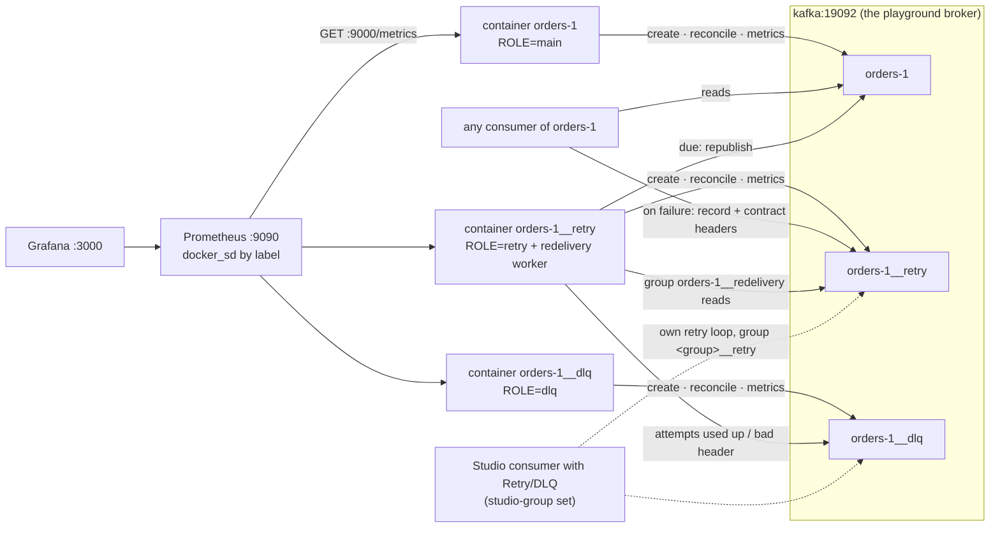

# Topic containers — design

Status: approved on 2026-10-08. M1, M2 and M3 are built, from
`docs/superpowers/plans/2026-10-08-topic-containers-m1.md`,
`docs/superpowers/plans/2026-10-08-topic-containers-m2.md` and
`docs/superpowers/plans/2026-10-08-topic-containers-m3.md`.

A topic deployed as three long-running containers on the playground's broker:
`orders-1`, `orders-1__retry` and `orders-1__dlq`. Each container owns one
topic. It creates the topic, keeps its configuration in the desired state and
serves Prometheus metrics for it. The retry container also runs the redelivery
worker, which sends parked records back to the main topic or on to the DLQ.
Prometheus finds the containers by their labels, and Grafana shows them.

## 1. Goal and scope

Purpose: a **learning sandbox**, like the rest of the repository. It teaches
two things:

- a topic as a resource that something owns and reconciles, instead of a
  one-shot job that creates it and exits;
- non-blocking retry with a shared redelivery worker, and how to observe it.

Success criteria:

- `make up` starts `orders-1`, `orders-1__retry` and `orders-1__dlq` next to
  the existing stack, and waits until all three are healthy. Healthy means that
  the topic exists in the desired state.
- `make topics` shows the three topics with 3 partitions each. A config changed
  by hand returns to the desired value within one reconcile interval (10 s).
- A record that a consumer parks in `orders-1__retry` with the contract headers
  (section 3.4) comes back to `orders-1` after its backoff. Once its attempts
  run out, it goes to `orders-1__dlq`.
- Prometheus at http://localhost:9090 scrapes every container without a target
  list. Grafana at http://localhost:3000 shows the provisioned dashboard. The
  alerts page shows the DLQ alert firing once a record is parked.
- `make down && make verify` ends with `TOPICS OK` and `VERIFY OK`.
- `make down` leaves no container, volume or network.

Relationship to what exists:

- The `x-topic` jobs and the `orders` and `events` topics stay as they are. The
  README walkthrough uses them. `orders-1` is a new topic, not a rename.
- Studio does not change. It keeps its own retry loop (its retry spec,
  Approach A). It meets these containers only through topic names and headers:
  the same `__retry` and `__dlq` suffixes, the same `studio-*` headers. Section
  3.5 shows that no record is handled by both.
- Redpanda Console stays the tool to browse records and headers. Studio stays
  the tool to draw and run flows.

Non-goals: a `replay` subcommand (section 3.7 does replay with kcat), Alertmanager,
bytes in and out per topic (section 2.3), tiered retry topics, more than one
broker, auth, TLS, metrics or Kafka data that survive `make down`, Swarm or
Kubernetes deployment (section 5.6 notes what would change), and any change
under `studio/`.

## 2. Reuse before building

Checked on 2026-10-08. Every exporter in this section was run against a
throwaway `apache/kafka:4.3.1` broker on this machine. The sources are in the
research notes at the end.

### 2.1 Metric exporters

| Candidate | Image, release | Maintained | Of the minimum metrics | Topic filter | Kafka 4.3.1 |
|---|---|---|---|---|---|
| kafka-exporter (danielqsj) | `danielqsj/kafka-exporter:v1.10.0`, 2026-09-08 | yes (master 2026-09-24) | partitions `kafka_topic_partitions`, under-replicated `kafka_topic_partition_under_replicated_partition`, end offset `kafka_topic_partition_current_offset`, lag `kafka_consumergroup_lag`; **no log size** | `--topic.filter`, `--topic.exclude`, `--group.filter`, `--group.exclude` (RE2) | works (lab, Sarama v1.47.0) |
| Kafka Lag Exporter (seglo) | `seglo/kafka-lag-exporter:0.8.2`, 2022-10-30 | **archived** (last push 2024-02-28); amd64 only | lag, end offset only for topics that have a group; no partitions, under-replicated or log size | `topic-whitelist` (HOCON file) | works (lab, emulated) |
| kminion (Redpanda) | `redpandadata/kminion:v2.3.6`, 2026-09-17 | yes | partitions (only as a label of `kminion_kafka_topic_info`), end offset `kminion_kafka_topic_partition_high_water_mark`, log size `kminion_kafka_topic_log_dir_size_total_bytes`, lag `kminion_kafka_consumer_group_topic_partition_lag`; **no under-replicated** | `minion.topics.allowedTopics` (the log-size collector ignores it, lab) | works (lab, franz-go) |
| Burrow (LinkedIn) | v1.9.6, 2026-05-11; **no published image** (built from its Dockerfile in the lab) | slowly | native `/metrics`: `burrow_kafka_consumer_partition_lag`, `burrow_kafka_topic_partition_offset`; no partitions, under-replicated or log size | none for topics (groups: `group-allowlist`) | works (lab) |
| JMX Prometheus javaagent on the broker | `jmx_prometheus_javaagent-1.7.0.jar`, 2026-10-06 (GitHub asset; Maven Central stops at 1.0.1) | yes | bytes in/out `kafka_server_brokertopicmetrics_bytesin_total` / `_bytesout_total`, log size `kafka_log_log_size`, under-replicated `kafka_cluster_partition_underreplicated`; **no lag**, no partition count | `includeObjectNames` / rules | works (lab), see 2.3 |

None of them covers the minimum list on its own. kafka-exporter comes closest,
with four of the six metrics and no log size. kminion has no under-replicated
metric.

### 2.2 What the stack already shows

- **Redpanda Console** (http://localhost:8080) shows topics, partitions,
  configs, records with their headers, and consumer groups with lag,
  interactively. Its `/admin/metrics` is about Console itself. It exports no
  per-topic series.
- **Studio's snapshot** (`studio/engine.go`) computes the end offsets of a
  flow's drawn topics (`ListEndOffsets`) and the lag of the flow's own groups
  (`adm.Lag` through `groupLag`, which also gives `waiting`). It does this only
  for a running flow, and it delivers JSON over SSE, not Prometheus series.

This design rebuilds neither. Records are still browsed in Console, and flows
still run in Studio. The containers add what neither has: Prometheus series
per topic. They read the broker with the same `kadm` calls Studio uses
(`ListEndOffsets`, `Lag`'s building blocks). Studio is `package main`, so they
cannot import its code; they repeat the arithmetic, which is a few lines.

One difference is deliberate. Studio's `groupLag` counts a partition the group
has not committed by the consumer's reset policy. A topic container cannot
know that policy, so it reports lag only for partitions the group has
committed. kafka-exporter does the same (lab).

### 2.3 Bytes in and out: left out

The broker is the only place that knows bytes in and out per topic, through
JMX. Exporting them would need three things:

- the agent jar, which no image in the stack ships (verified: `apache/kafka:4.3.1` has no JMX exporter jar);
- a bind mount or a custom broker image;
- a change to the `kafka` service.

A container-level `KAFKA_OPTS=-javaagent:…` also loads the agent into every
`kafka-*.sh` started in the broker container. That includes the compose
healthcheck, which then fails with `BindException: Address in use`, so the
broker never becomes healthy (lab). The only fix is a command override that
exports `KAFKA_OPTS` for the server process alone.

That cost buys two series. They are left out, and the README says so. They are
not approximated from client-side data. If they are wanted later, the exact
change is recorded in section 9, question 7.

### 2.4 Decision: custom, with kafka-exporter's names

The topic containers export their own metrics, written in Go with franz-go
`kadm` and `prometheus/client_golang`. The reasons:

- **The brief puts the metrics in the owner.** `/metrics` on each container is
  scoped to its topic. An exporter cannot run inside a `scratch` image next to
  the Go binary.
- **One cluster exporter is still not enough.** kafka-exporter covers four of
  the six minimum metrics. The container would still need custom code for log
  size, the info metric, the role metrics and `/healthz`. The cluster exporter
  would also need a topic filter that changes with every instance.
- **The code is small and already familiar.** It is `ListTopics`,
  `ListStartOffsets`, `ListEndOffsets`, `DescribeAllLogDirs`, `ListGroups`
  and `FetchManyOffsets`, per scrape. These are the calls the repository
  already uses, at the versions it pins.

Where a series means exactly what a kafka-exporter series means, it keeps
kafka-exporter's name and labels, so existing dashboards for kafka-exporter
work on these series. A later switch to a cluster-wide kafka-exporter would
also delete code without changing a dashboard. Everything else uses the
`topic_owner_` prefix (section 4).

### 2.5 Prior art for "a topic with an owner, a retry and a DLQ"

| Project | Release | What it does | Extend or reuse here? |
|---|---|---|---|
| Strimzi Topic Operator | 1.2.0, 2026-08-20 | One `KafkaTopic` resource per topic. Reverts config changes made outside the resource. Increases partitions only (decreases fail with `PartitionDecreaseException`). Changes replicas only with Cruise Control. No retry or DLQ. | Needs Kubernetes. The reconcile semantics are borrowed: drift reverted, partitions up only, replicas never. |
| Spring Kafka non-blocking retries (`@RetryableTopic`) | v4.1.1, 2026-08-20 | Topics `<t>-retry[-N]` and `<t>-dlt`. Headers `retry_topic-backoff-timestamp` (absolute due time), `retry_topic-attempts`, `retry_topic-original-timestamp`, `kafka_dlt-*`. **Pauses the retry partition** until the record is due. Republishes to the same partition number by default. | A JVM library. The pattern maps onto this design (pause the partition, attempts header). The naming does not: this repository already has `__retry` and `__dlq`. |
| Kafka Connect DLQ | Kafka 4.3.1 | `errors.deadletterqueue.topic.name`, headers `__connect.errors.*` (opt-in). Sink connectors only. Retries happen in memory, blocking. No retry topic. | Needs a Connect worker. Its header set is a useful checklist for what a parked record should carry: origin, stage, error. |

**Verdict: build, in Go, in the house style.** Nothing above runs in a
Docker-only Go playground, and the parts worth having are patterns, not code.
Any new code is Go with `github.com/twmb/franz-go` v1.22.1 and
`github.com/twmb/franz-go/pkg/kadm` v1.19.0, the versions in `studio/go.mod`.
Metrics use `github.com/prometheus/client_golang` v1.24.1. That is the
newest release older than today, from 2026-07-24, and it needs Go 1.25. v1.25.0
was published on 2026-10-08, which is too new to pin. The image is a
multi-stage build from `golang:1.27.1-alpine` onto `scratch`, `USER 65534`,
like `producer/` and `studio/`.

### 2.6 What was checked

- Context7: `/twmb/franz-go` (kadm topic, config, partition, offset, group and
  log-dir calls; kgo pause and resume, marks and commits). Every signature was
  confirmed with `go doc` against the pinned modules in the module cache.
- Context7: `/prometheus/client_golang` (custom registry, `HandlerFor`,
  collectors, histograms).
- Context7: `/prometheus/prometheus` and `/websites/prometheus_io`
  (`docker_sd_configs`, relabelling, rule files, the HTTP API).
- Context7: `/websites/grafana_grafana` (datasource, dashboard and alert-rule
  provisioning).
- Context7, for the exporters and prior art: `/danielqsj/kafka_exporter`,
  `/redpanda-data/helm-charts` (kminion's configuration),
  `/prometheus/jmx_exporter`, `/apache/kafka`, `/spring-projects/spring-kafka`,
  `/strimzi/strimzi-kafka-operator`.
- Context7 had no entry for seglo's exporter, Burrow or kminion itself. Their
  repositories were read directly.
- Image tags and dates were read from Docker Hub's tag API and from GitHub
  release pages on 2026-10-08.

Other tools, and what for:

- **Web search and fetch:** releases, Docker Hub tags, exporter source.
- **`go doc`:** exact signatures.
- **Docker on this machine** (Docker Desktop 29.8.2, Compose v5.5.1, arm64) for
  throwaway labs:
  - every exporter against `apache/kafka:4.3.1`;
  - the javaagent;
  - kcat 1.7.1 headers;
  - Prometheus scraping a host name with `__`;
  - `docker_sd_configs` and the Docker socket's permissions;
  - the images' declared volumes and users;
  - `docker compose run --name -l -e` on a service with `container_name`.
- **The Kafka 4.3.1 client jar:** the list of topic config names.

## 3. Architecture

### 3.1 Overview



- **One image, three roles.** `kafka-playground/topic-owner:0.1.0` is one Go
  binary (`/topic-owner`). `ROLE=main|retry|dlq` selects the role defaults and,
  for `retry`, the worker. A container derives its topic name from
  `BASE_NAME`, `INSTANCE` and `ROLE`.
- **The containers do not talk to each other.** Each one talks only to the
  broker. The retry container produces to the main topic and to the DLQ, and
  `depends_on` starts it after both (section 5).
- **Studio meets them only on the broker.** It reads and writes the same topics
  and headers. It never calls a container, and no container calls it.
- **Every container serves `:9000`** inside the compose network, the same port
  as Studio's node containers. `GET /healthz` and `GET /metrics` are on it.
  No port is published to the host. The demos go through Prometheus (section 8).

### 3.2 State

No state survives a restart. Everything is re-derived from the broker:

| What | Kept where | After a restart |
|---|---|---|
| Desired topic state | environment | the same |
| Actual topic state | broker | read again on start |
| Last reconcile result (for `/healthz`) | memory | recomputed by the first reconcile |
| Worker's position in `__retry` | committed offsets of group `<base>-<instance>__redelivery` | resumes from the last commit; uncommitted records are read again |
| Records waiting for their due time | memory (one queue per paused partition) | read again from the last commit and waited out again (their due time comes from the record) |
| Counters (`…_total`) | memory | start again at 0; `rate()` and `increase()` treat that as a reset |

`docker compose restart orders-1` and `make down && make up` therefore end in
the same state. With `make down`, the topics go too, because the broker has no
volume, and the containers create them again.

### 3.3 Reconcile

On start, then every 10 s, each container compares its topic with the desired
state:

| Aspect | Desired | Action on a difference |
|---|---|---|
| Existence | the topic exists | `CreateTopic(partitions, rf, configs)`. `TopicAlreadyExists` (a race with Studio or another owner) is no failure: nothing is logged as created, `/healthz` says `created by someone else first; reconciling it on the next pass`, and the next pass reconciles the topic it finds. |
| Partitions | `PARTITIONS` (default 1) | Fewer: `UpdatePartitions(set)` raises them. Equal: no call. **More: cannot fix.** Partitions never decrease. |
| Replication factor | `REPLICATION_FACTOR` (default 1, and only 1 is accepted) | Never changed. A different value on an existing topic **cannot be fixed**. |
| Configs | role defaults, overridden by `TOPIC_CONFIG_*` (3.6) | `AlterTopicConfigs`, the incremental call. `SetConfig` for each desired key whose topic-level value (source `DYNAMIC_TOPIC_CONFIG`) differs or is missing. `DeleteConfig` for each topic-level override that is not desired. Broker and default values are left alone. |

- **When it cannot fix a difference,** the container logs the reason once and
  keeps running. `/healthz` answers 503 with that reason, and
  `topic_owner_reconciled` is 0. The next reconcile checks again. Nothing
  short of deleting the topic or changing the environment clears it.
  - The container stays up, so its logs and `/metrics` stay readable.
  - Compose then reports it unhealthy, and `make up` (`--wait`) fails with its
    name.
- **A rejected alter** (for example an invalid value) is treated the same way,
  with the broker's message as the reason.
- **`REPLICATION_FACTOR` other than 1** is a configuration error, not drift.
  The container exits 1 at start, before it connects, with the line in 3.6.
  This mirrors the Studio deploy check that refuses it.
- **Owning means drift is reverted.** A config changed by hand (Console,
  `kafka-configs.sh`, Studio) returns within 10 s. To change a config, change
  the environment and recreate the container.

`/healthz` answers 200 `ok` only when the last reconcile left the topic in
the desired state. A broker that cannot be reached counts as not in the
desired state. `/topic-owner -healthcheck` fetches `/healthz`. It exits 0 on
200, and otherwise exits 1 and prints the body. Docker keeps that output in
`.State.Health.Log`, so `docker inspect` shows why a container is unhealthy.
`depends_on: {orders-1: {condition: service_healthy}}` thus gives a consumer
what `service_completed_successfully` on a topic job gives today: the topic
exists, with the right partitions and configs.

### 3.4 The failure contract (for a consumer of the main topic)

A consumer of `<base>-<instance>` that fails a record parks it in
`<base>-<instance>__retry`, then commits the original:

- **Key and value:** the record's own, unchanged.
- **Headers:** the record's own headers, with the `studio-*` ones set as in the
  table below. A non-Studio publisher **does not set `studio-group`**: that
  header means "a Studio consumer's own loop retries this" (3.5).

The prefix `studio-` stays. It is the vocabulary already on these topics,
written by Studio's `failureHeaders` (`studio/retry.go`). One prefix means:

- one header set to read in Console;
- the DLQ container counts both Studio's and the worker's parked records the same way;
- a Studio tail shows both alike.

A second prefix would split one contract in two. The prefix names the
contract, not the writer.

| Header | Set by | Format | The worker reads it | The worker writes it |
|---|---|---|---|---|
| `studio-group` | Studio consumers only | the consumer's group | present (non-empty): **skip**, a Studio loop owns the record | never |
| `studio-attempt` | the publisher, on every failure | failed tries so far, decimal, `1`, `2`, … (the publisher writes the value it read plus 1, or `1` when it is absent) | missing: `1`. Not a positive integer: bad header, so DLQ. `≥ MAX_ATTEMPTS`: DLQ. | never changes it |
| `studio-error` | the publisher | the last error's first line, at most 1 KiB, cut at a character boundary, `<step>: …` (Studio writes `sink: …`, `forward to <topic>: …`, `transform: …`, `router: rule N: …`) | no | only on a bad header: `retry: bad header studio-attempt "x"` (or `studio-backoff-ms`) |
| `studio-origin` | the first publisher, once | `topic[partition]@offset` where the record was first read | no (consumers dedupe on it, 3.5) | when it is missing: the retry record's own position, `orders-1__retry[0]@7` |
| `studio-first-failure` **(new)** | the first publisher, once | RFC 3339 UTC with milliseconds, `2026-10-08T14:00:00.000Z`, the publisher's clock | no (dashboards, Console) | when it is missing: the retry record's timestamp, in the same format |
| `studio-backoff-ms` **(new)** | the publisher, on every failure | decimal milliseconds, `0`–`3600000`, counted **from the record's timestamp in the retry topic** | missing: `BACKOFF_MS` (default 5000). Outside the range or not a number: bad header, so DLQ. | never |

#### The backoff clock

The backoff is relative. The retry topic stamps every record with the broker's
clock: the retry role's default config is `message.timestamp.type=LogAppendTime`
(3.6). The due time is the record's timestamp plus `studio-backoff-ms`. So:

- **One clock decides.** The broker's clock sets the due time, not the
  publisher's. The worker reads the broker's stamp and compares it with its
  own wall clock, and on one laptop those are the same clock.
- **It is Studio's rule.** Studio's loop waits `delay_ms` from the record's
  timestamp. The worker does the same, with the delay coming from a header
  instead of a setting.
- **The publisher picks the backoff policy.** Writing
  `1000 × 2^(attempt-1)` gives exponential backoff without any change to the
  worker.

An absolute due time, as in Spring's `retry_topic-backoff-timestamp`, would put
the publisher's clock in charge. Here that clock is the same machine's, so the
gain is small, and the relative form also keeps a hand-written record simple.

#### A record with no headers

A record written by hand into `__retry` with no headers belongs to the worker.
It counts as attempt 1 and waits `BACKOFF_MS`. Its `studio-origin` and
`studio-first-failure` are set from its own position and timestamp when it is
redelivered.

Worked example. kcat 1.7.1 in the stack's `confluentinc/cp-kcat:8.2.4` writes
headers with `-H name=value` (checked). `make kcat` (section 7) runs it on the
compose network:

```sh
echo '{"id":42}' | make kcat args='-P -t orders-1__retry -k order-42 \
  -H studio-attempt=1 -H studio-backoff-ms=5000 \
  -H "studio-error=sink: http 503" -H "studio-origin=orders-1[2]@17" \
  -H studio-first-failure=2026-10-08T14:00:00.000Z'
```

About 5 s later the record is on `orders-1`, with key `order-42`, the same
value and the same five headers. This command reads it there:

```sh
make kcat args='-C -t orders-1 -o -1 -e -J'
```

Read with `-J`, its headers print as a flat list:
`"headers":["studio-attempt","1","studio-backoff-ms","5000",…]`.
kcat's `%h` format joins headers as `name=value` with commas and does no
escaping, so a comma inside `studio-error` makes it ambiguous. Use `-J` to
inspect them.

### 3.5 The redelivery worker (ROLE=retry)

#### Ownership

The worker consumes `<base>-<instance>__retry` in group
`<base>-<instance>__redelivery`. It owns exactly the records **without** a
non-empty `studio-group` header. A Studio consumer's retry loop, in group
`<group>__retry`, owns exactly the records whose `studio-group` equals its
group, and it skips the rest, a record with no headers included
(`retryRecord` in `studio/retry.go`). No record satisfies both rules, so no
record is handled twice:

| `studio-group` header | Worker | Studio loop of group `G` |
|---|---|---|
| absent or empty | **handles** | skips |
| `G` | skips (`topic_owner_skipped_total`) | **handles** |
| another group `H` | skips | skips (the loop of `H` handles it, if it runs) |

A Studio record whose loop no longer runs (Retry turned off, the flow deleted)
stays in `__retry`. The README already says so. Here it also shows: the lag of
`G__retry` stays above 0, and `TopicRetryWaiting` fires (4.2).

#### Group name

The group name cannot collide with Studio's. Studio's retry group is always
`retryGroup(g) = g + "__retry"`, so it ends in `__retry` for every group `g` a
user may type. `orders-1__redelivery` ends in `__redelivery` and never in
`__retry`.

A Studio user could still type `orders-1__redelivery` as a consumer's *main*
group. That is the general case of two consumers sharing a group by choice;
the README names the group so that nobody does it by accident.

The group is franz-go only. kcat's librdkafka and franz-go share no assignor,
so the broker refuses a mixed group (`AGENTS.md`). Never point `kcat -G` at it.

The name fits Kafka's limits: `<base>-<instance>` is at most 242 characters, so
the group is at most 254.

#### Per record, in partition order

| Condition (checked in this order) | Action |
|---|---|
| `studio-group` non-empty | mark the record, count `skipped` |
| `studio-attempt` or `studio-backoff-ms` present but invalid | produce to `__dlq` with `studio-error: retry: bad header …`, count `dead_lettered{reason="bad_header"}` |
| attempt `≥ MAX_ATTEMPTS` | produce to `__dlq`, headers as read (plus origin and first failure, when missing), count `dead_lettered{reason="attempts"}` |
| now `<` timestamp + backoff | wait (below) |
| otherwise | produce to `<base>-<instance>`, same key, value and headers (plus origin and first failure, when missing), count `redeliveries`, observe the backoff |

- **Commit order.** A record is marked for commit only after its produce is
  acknowledged (`ProduceSync`, then `MarkCommitRecords`, with `AutoCommitMarks`).
- **Produce failures.** If a produce fails, for example because the target
  topic is missing, the record is not marked. The worker logs the failure,
  holds the partition and tries again on the next pass. Nothing is lost.
- **First start.** A new group starts at the beginning of `__retry`, so it
  takes every parked record. Studio's loop does the same (`AtStart`).

#### `MAX_ATTEMPTS`

`MAX_ATTEMPTS` follows the brief. When `studio-attempt` reaches it, the record
goes to the DLQ. With the default of 3, a record is tried 3 times: the first
try plus 2 redeliveries.

Studio counts differently. Its `attempts` is the number of retries *after*
the first try, so Studio's `attempts: 3` corresponds to `MAX_ATTEMPTS=4`. Both
write the same `studio-attempt` value for the same failure. Only the setting's
meaning differs. The README states the mapping, and section 9 asks whether to
align them.

#### How it waits: pause the partition

The worker reads records in partition order. When a partition's first
unhandled record is not due yet, the worker:

1. pauses that partition (`PauseFetchPartitions`);
2. keeps that partition's records it already holds in a queue;
3. resumes the partition once its queue is empty.

The other partitions keep flowing. The poll loop sleeps until the earliest due
time among the queues, or until new records arrive. The worker's fetches wait
at most 1 s on the broker (`FetchMaxWait`), so a resumed partition's records
arrive within a second instead of after kgo's default 5 s long poll. kgo keeps
a paused partition assigned. It strips that partition's already buffered
records from the poll without advancing its cursor, and fetches them again from
the same offset after the resume (source, kgo v1.22.1): nothing is lost and
nothing is delivered twice. On a rebalance, the queues of revoked partitions
are dropped, because their records were never committed, and the next owner
reads them again.

The alternatives:

- **Studio's way, waiting in line on every partition**, fits one fixed delay
  per consumer. With a backoff per record, it stalls every partition behind
  one long wait.
- **Ordering by due time across a partition** (a heap) lets a short wait
  overtake a long one. It costs a commit watermark per partition: only the
  lowest unhandled offset can be committed, and everything above it is held in
  memory.

**Cost of the chosen approach:** a long backoff holds up shorter ones behind it
**on the same partition**. The answer is more partitions on `__retry` (they
follow `PARTITIONS`), or a publisher that uses one backoff per attempt number.
Spring Kafka makes the same choice and states the same limit.

#### Semantics, stated in the README

- **At-least-once.** A crash between the acknowledged produce and the commit
  redelivers the record twice. A crash before the acknowledgement re-reads the
  record and loses nothing.
- **Key order is not preserved.** The redelivered record lands after records
  produced while it waited. It is produced with its key, so it goes to the
  key's partition if the partition count is unchanged. A record with a null
  key goes to any partition.
- **Every group on the main topic sees the redelivery.** That includes an
  `orders-audit`-style fan-out group, which never failed the record. This is
  exactly what Studio's design rejected for its own loop (Approach A), and the
  reason the two coexist: a Studio consumer keeps its retries private, while
  this worker serves any client that can write headers.
- **Telling a redelivery from an original.** A redelivery carries
  `studio-origin`, and `studio-attempt` if its publisher set one; an original
  carries neither.
- **Deduplicating.** A consumer that must not act twice dedupes on
  `studio-origin` when present, else on its own `topic[partition]@offset`. The
  two values are the same for the original and every redelivery of it.

#### Where it meets Studio

- **A Studio consumer on `orders-1` with Retry** parks records with
  `studio-group`. Its own loop retries them. The worker skips them.
- **A Studio consumer with only DLQ** writes to `orders-1__dlq` directly. The
  DLQ container counts those records too.
- **A Studio consumer that fails a record the worker redelivered** writes it
  to `__retry` with its own `studio-group` and `studio-attempt: 1`. Studio
  counts the tries of its own path, and its `failureHeaders` replaces the four
  headers it owns. It keeps `studio-origin` and the two new headers. From then
  on the record belongs to that consumer's loop. Section 9 lists this
  interaction.

### 3.6 Configuration

All configuration comes from the environment. Errors are fatal at start: the
container exits 1 with one line on stderr, before it connects.

| Variable | Roles | Default | Rule |
|---|---|---|---|
| `BASE_NAME` | all | required | `^[a-zA-Z0-9][a-zA-Z0-9_-]*$`, no `__`, does not end in `-<digits>` |
| `INSTANCE` | all | required | `^[1-9][0-9]*$` |
| `ROLE` | all | required | `main`, `retry` or `dlq` |
| `KAFKA_BROKERS` | all | required | the repository's name for it, fed from the `*bootstrap` anchor (`kafka:19092`) |
| `PARTITIONS` | all | `1` | integer ≥ 1, as in the `x-topic` job |
| `REPLICATION_FACTOR` | all | `1` | must be 1 |
| `TOPIC_CONFIG_<NAME>` | all | role defaults | a value sets the config; an empty value removes the default |
| `MAX_ATTEMPTS` | retry only | `3` | 1–10 (Studio's range for `attempts`) |
| `BACKOFF_MS` | retry only | `5000` | 100–60000 (Studio's range for `delay_ms`); for records without `studio-backoff-ms` |

#### Names

The topic name is `<BASE_NAME>-<INSTANCE>`, plus `__retry` or `__dlq` for those
roles. Every name parses back one way:

- strip a trailing `__retry` or `__dlq` to get the role;
- the base cannot contain `__`, so that suffix is unambiguous;
- split the rest at its last `-`;
- the base cannot end in `-<digits>`, and the instance has no leading zeros, so
  that split is the only one.

Rules beyond Studio's are kept to what this needs:

- **Studio's rules still apply.** The name matches `topicNameRe`, and
  `<base>-<instance>` is at most 242 characters (`maxInputTopic`), so
  `<name>__retry` stays within Kafka's 249.
- **No `.` in the base.** Every derived name contains `_`. Kafka maps `.` and
  `_` to the same character in its metric names, so it treats `a.b` and `a_b`
  as colliding. Forbidding `.` removes that class of error, and with it
  Studio's `.` and `..` special cases. `_` is allowed, as in `orders_eu`.
- **The base starts with a letter or digit.** The container is named exactly
  like its topic, and Docker container names must start with one.

The container and compose service are named like the topic, so `docker ps`
reads like `make topics`. `__` is legal in Compose service names and Docker
container names. Docker's DNS resolves `orders-1__retry`, and Prometheus
v3.15.0 scraped it by name (lab). Discovery scrapes by IP anyway (5.4), so no
`hostname:` is needed. Long names are fine for the same reason, though a DNS
label is limited to 63 characters.

#### Topic configs: one variable per config

`TOPIC_CONFIG_RETENTION_MS` sets `retention.ms`. The rule:

- **Reading:** strip `TOPIC_CONFIG_`, lower-case the rest, and replace `_` with `.`.
- **Writing:** upper-case the name and replace `.` with `_`.

The rule is reversible because every topic config name in Kafka 4.3.1 (30
names, read from `TopicConfig` in `kafka-clients-4.3.1.jar`) is lower-case,
dotted, and has no `_`.

It is chosen over a single `TOPIC_CONFIGS=k=v,…` for two reasons:

- **Values may contain commas.** `cleanup.policy=compact,delete` is valid.
- **A map entry per config** reads and diffs one line per config, in the house
  style of `environment:` maps.

The values themselves are validated by the broker. A rejected value makes the
container unhealthy, with the broker's message.

#### Role defaults

| Role | Defaults | Why |
|---|---|---|
| main | none | the broker's defaults (7 days, delete) |
| retry | `message.timestamp.type=LogAppendTime` | the backoff clock (3.4) |
| dlq | `retention.ms=-1` | parked records stay until someone acts on them. `make down` still deletes them with the broker. |

#### Fatal lines, quoted for the verify target

- `topic-owner: BASE_NAME "owner.verify" is not a base name: use letters, digits, _ and -, start with a letter or digit, no __, no -<digits> at the end`
- `topic-owner: INSTANCE "01" is not a positive integer without leading zeros`
- `topic-owner: ROLE "x" must be main, retry or dlq`
- `topic-owner: <name> is too long: <base>-<instance> may have at most 242 characters`
- `topic-owner: owner-verify-1: single-broker playground: replication_factor must be 1` (the verify target greps the part after `owner-verify-1: `, Studio's message word for word)
- `topic-owner: MAX_ATTEMPTS is only for ROLE=retry` (and the same for `BACKOFF_MS`)
- `topic-owner: MAX_ATTEMPTS must be between 1 and 10`, `topic-owner: BACKOFF_MS must be between 100 and 60000`

#### Reconcile and worker lines

Each line is prefixed by the topic. A line appears when something changes, not
on every pass.

- `owner-verify-1: created with 2 partitions`
- `owner-verify-1: set retention.ms=3600000 (was 1000)`, `(was unset)` when it had no override
- `owner-verify-1: removed retention.bytes (was 5)`
- `owner-verify-1: partitions 2 -> 3`
- `owner-verify-1: has 3 partitions, wants 2: partitions never decrease (delete the topic, or set PARTITIONS=3)`. This is also the `/healthz` body.
- `owner-verify-1: replication factor 2, wants 1: never changed`
- `owner-verify-1: kafka: <error>`, while the broker cannot be reached
- `owner-verify-1__retry: redelivered owner-verify-1__retry[0]@0 to owner-verify-1 after 1.0s (attempt 1 of 2)`
- `owner-verify-1__retry: dead-lettered owner-verify-1__retry[0]@1 to owner-verify-1__dlq: attempt 2 of 2`
- `owner-verify-1__retry: dead-lettered owner-verify-1__retry[0]@3 to owner-verify-1__dlq: retry: bad header studio-backoff-ms "soon"`
- `owner-verify-1__retry: skipped owner-verify-1__retry[0]@2: studio-group owner-verify-studio runs its own retry loop`

### 3.7 The DLQ: inspection and manual replay

The DLQ role does not consume anything automatically.

#### Inspect

- **Console** at http://localhost:8080 → Topics → `orders-1__dlq` shows each
  record with its headers.
- **A Studio flow:** draw a topic named `orders-1__dlq` and wire a log consumer
  to it. Its tail shows the headers, as the README already says.
- **kcat:**

  ```sh
  make kcat args='-C -t orders-1__dlq -o beginning -e -J'
  ```

#### Replay

kcat can only copy key and value, not the headers record by record. That is
the right default anyway: a replayed record starts over as an original, with
fresh attempts.

```sh
make kcat args='-C -t orders-1__dlq -o beginning -e -f "%k\t%s\n"' \
  | make kcat args='-P -t orders-1 -K "\t"'
```

Kafka cannot delete single records. After a full replay, move the DLQ's start
past what was replayed. That brings the parked count to 0 and resets the oldest
age:

```sh
docker compose exec -T kafka /opt/kafka/bin/kafka-delete-records.sh \
  --bootstrap-server localhost:19092 --offset-json-file /dev/stdin <<'EOF'
{"partitions":[{"topic":"orders-1__dlq","partition":0,"offset":-1}],"version":1}
EOF
```

Write one entry per partition. `-1` means "up to the end".

A `replay` subcommand would win only if replays had to keep headers, so that
a record keeps its `studio-origin` for deduplication. That is a later addition
(section 9). The two commands above cover the playground.

## 4. Metrics

### 4.1 Exported series

Every series carries `topic`. The series that keep kafka-exporter's names keep
its labels too (`partition`, `consumergroup`).

The info metric names the instance number `topic_instance`, because Prometheus
reserves the target label `instance`. A metric label of that name would come
out as `exported_instance`. The target's `instance` is set to the container
name (5.4), so `instance="orders-1__retry"` and `topic="orders-1__retry"` agree.

Topic-level series are collected at scrape time, under a 3 s deadline that
fits the 4 s scrape timeout. If an admin call fails, the collector exports what
it has and sets `topic_owner_kafka_up` to 0. Counters are created at start with
every label value at 0, so `increase()` sees the first event. Role metrics are
updated by the worker as it works.

| Metric | Type | Labels | Roles | Meaning | Name source |
|---|---|---|---|---|---|
| `topic_owner_info` | gauge (1) | topic, base, topic_instance, role | all | identity | own (`_info` convention) |
| `topic_owner_reconciled` | gauge (0/1) | topic | all | 1 when the last reconcile left the topic in the desired state; mirrors `/healthz` | own |
| `topic_owner_kafka_up` | gauge (0/1) | topic | all | 1 when this scrape's admin calls succeeded | own |
| `kafka_topic_partitions` | gauge | topic | all | partition count | **kafka-exporter**, same meaning |
| `kafka_topic_partition_under_replicated_partition` | gauge (0/1) | topic, partition | all | 1 when ISR is smaller than the replica set. Always 0 on one broker; kept for the day there are more. | **kafka-exporter**, same meaning |
| `kafka_topic_partition_current_offset` | gauge | topic, partition | all | log end offset | **kafka-exporter**, same meaning |
| `kafka_topic_partition_oldest_offset` | gauge | topic, partition | all | log start offset | **kafka-exporter**, same meaning |
| `topic_owner_partition_log_size_bytes` | gauge | topic, partition | all | log size from `DescribeAllLogDirs`, summed over replicas (equals the log size on one broker) | own: kafka-exporter has none |
| `kafka_consumergroup_current_offset` | gauge | consumergroup, topic, partition | all | the group's committed offset, for every group with a commit on this topic | **kafka-exporter**, same meaning |
| `kafka_consumergroup_lag` | gauge | consumergroup, topic, partition | all | end offset − committed offset, committed partitions only | **kafka-exporter**, same meaning (it also has no series without a commit, lab) |
| `topic_owner_redeliveries_total` | counter | topic | retry | records republished to the main topic | own |
| `topic_owner_dead_lettered_total` | counter | topic, reason (`attempts`, `bad_header`) | retry | records the worker moved to the DLQ | own |
| `topic_owner_skipped_total` | counter | topic | retry | records left to a Studio loop (`studio-group` set) | own |
| `topic_owner_backoff_seconds` | histogram | topic | retry | the backoff each redelivered record asked for (header or `BACKOFF_MS`); buckets `ExponentialBuckets(0.1, 2, 12)`, 0.1 s to 204.8 s | own |
| `topic_owner_oldest_message_timestamp_seconds` | gauge | topic, partition | dlq | the timestamp of the record at the partition's start offset, for non-empty partitions | own |

How the oldest timestamp is fetched:

- Each scrape of the DLQ role fetches it with
  `kadm.ListOffsetsAfterMilli(ctx, 0, topic)`: one admin call that returns the
  first record with a timestamp ≥ 0, which is the oldest, with its timestamp,
  and consumes nothing (confirmed on the broker, section 9 question 2). Only
  partitions the scrape read as non-empty get a series.
- Nothing is cached. An earlier design kept the time per start offset; the
  extra call every 5 s costs less than keeping that cache true when a DLQ is
  emptied or recreated.

Not exported: bytes in and out (2.3).

### 4.2 Derived in PromQL (dashboard and rules)

| What | Expression |
|---|---|
| messages in per second | `sum by (topic) (rate(kafka_topic_partition_current_offset[1m]))`. The end offset is a gauge, as in kafka-exporter. `rate()` treats the drop after a topic is re-created (`make down && make up`) as a counter reset, which it is. |
| log size per topic | `sum by (topic) (topic_owner_partition_log_size_bytes)` |
| lag per group | `sum by (consumergroup, topic) (kafka_consumergroup_lag)` |
| waiting (Studio's word) | `sum by (topic) (kafka_consumergroup_lag{consumergroup=~".+__redelivery"})`: the worker group's lag on its retry topic |
| parked in the DLQ | `sum by (topic) (kafka_topic_partition_current_offset{topic=~".+__dlq"} - kafka_topic_partition_oldest_offset{topic=~".+__dlq"})`. Offsets count records here: the DLQ is `delete`, not compacted, and its writers are not transactional. |
| age of the oldest parked record | `time() - min by (topic) (topic_owner_oldest_message_timestamp_seconds)` |
| redeliveries, moves to the DLQ | `rate(topic_owner_redeliveries_total[5m])`, `sum by (topic) (rate(topic_owner_dead_lettered_total[5m]))` |
| backoff p50 / p95 | `histogram_quantile(0.5, sum by (le, topic) (rate(topic_owner_backoff_seconds_bucket[5m])))` |

The role is in the name (`__retry`, `__dlq`), so rules select by `topic` and
need no join with `topic_owner_info`.

Alert rules (`prometheus/rules.yml`, one group `topic-owners`). They are
quoted because the verify target greps the alert name:

| Alert | Expression | `for` | Why |
|---|---|---|---|
| `TopicConsumerLagHigh` | `sum by (consumergroup, topic) (kafka_consumergroup_lag{topic!~".+__(retry\|dlq)"}) > 100` | 2m | a consumer of a main topic falls behind |
| `TopicDLQGrowing` | `sum by (topic) (increase(kafka_topic_partition_current_offset{topic=~".+__dlq"}[10m])) > 0` | 0s | any newly parked record is news in a playground |
| `TopicRetryWaiting` | `sum by (consumergroup, topic) (kafka_consumergroup_lag{topic=~".+__retry"}) > 0` | 5m | records sit in a retry topic longer than any sensible backoff: the worker is down, or a Studio loop stopped (3.5) |
| `TopicOwnerUnhealthy` | `up{job="topic-owners"} == 0 or topic_owner_reconciled == 0` | 1m | a running owner fails its scrapes, or its topic is not in its desired state |

`TopicDLQGrowing` keeps firing for 10 minutes after the last parked record,
also after its topic is deleted: `increase()` still sees the samples inside
its window (M3). `make verify` leaves it firing for `owner-verify-1__dlq`.

`up == 0` covers only a running owner that fails its scrapes: `docker_sd` lists
running containers, so a stopped owner drops out of discovery and its `up`
goes stale (M3). An alert for a missing owner is not built.

No Alertmanager. On a laptop there is nothing to route to, and the alerts page
(http://localhost:9090/alerts) plus a dashboard panel on `ALERTS` show the
state. Adding one later is an `alerting:` block in `prometheus.yml` and a
service.

## 5. Compose layout

### 5.1 The anchor family (house style)

One `x-topic-owner` anchor holds what every role shares. Each instance has one
labels anchor and one environment anchor. The retry and DLQ services merge
those and change only `ROLE` and the role label. YAML merge is shallow, so the
retry service's own `depends_on` merges `*after-kafka` back in (`AGENTS.md`).

The services go **after `producer`** in the file, because they use the
`*bootstrap` anchor, which is defined there.

```yaml
# Topic owner: one long-running container per topic (topic-owner/, Go).
# ROLE=main owns <base>-<instance>; retry owns <base>-<instance>__retry and runs
# the redelivery worker; dlq owns <base>-<instance>__dlq. Each creates its
# topic, keeps it in the desired state (every 10 s) and serves /healthz and
# /metrics on :9000 inside the network. Declare one block of three per
# instance; container name = service name = topic name.
x-topic-owner: &topic-owner
  build: ./topic-owner
  image: kafka-playground/topic-owner:0.1.0
  pull_policy: build
  depends_on: *after-kafka
  healthcheck:
    test: ["CMD", "/topic-owner", "-healthcheck"]
    interval: 2s
    retries: 30
```

```yaml
  orders-1:
    <<: *topic-owner
    container_name: orders-1
    labels: &orders-1-labels
      topic-owner.base: orders
      topic-owner.instance: "1"
      topic-owner.role: main
    environment: &orders-1-env
      KAFKA_BROKERS: *bootstrap
      BASE_NAME: orders
      INSTANCE: 1
      ROLE: main
      PARTITIONS: 3

  # Produces to orders-1 and orders-1__dlq, so it starts after both.
  orders-1__retry:
    <<: *topic-owner
    container_name: orders-1__retry
    depends_on:
      <<: *after-kafka
      orders-1: {condition: service_healthy}
      orders-1__dlq: {condition: service_healthy}
    labels: {<<: *orders-1-labels, topic-owner.role: retry}
    environment: {<<: *orders-1-env, ROLE: retry, MAX_ATTEMPTS: 3}

  orders-1__dlq:
    <<: *topic-owner
    container_name: orders-1__dlq
    labels: {<<: *orders-1-labels, topic-owner.role: dlq}
    environment: {<<: *orders-1-env, ROLE: dlq}
```

The labels and the environment say the same things on purpose. Docker and
Prometheus read labels; the binary reads its environment. Both sit in the same
anchor pair, three lines apart, so they change together.

### 5.2 Adding `orders-2`, or another base

Adding an instance is one block of three services with new anchors. Only the
`main` service spells out base, instance and partitions:

```diff
+  orders-2:
+    <<: *topic-owner
+    container_name: orders-2
+    labels: &orders-2-labels
+      topic-owner.base: orders
+      topic-owner.instance: "2"
+      topic-owner.role: main
+    environment: &orders-2-env
+      KAFKA_BROKERS: *bootstrap
+      BASE_NAME: orders
+      INSTANCE: 2
+      ROLE: main
+      PARTITIONS: 6
+
+  orders-2__retry:
+    <<: *topic-owner
+    container_name: orders-2__retry
+    depends_on:
+      <<: *after-kafka
+      orders-2: {condition: service_healthy}
+      orders-2__dlq: {condition: service_healthy}
+    labels: {<<: *orders-2-labels, topic-owner.role: retry}
+    environment: {<<: *orders-2-env, ROLE: retry, MAX_ATTEMPTS: 5, BACKOFF_MS: 2000}
+
+  orders-2__dlq:
+    <<: *topic-owner
+    container_name: orders-2__dlq
+    labels: {<<: *orders-2-labels, topic-owner.role: dlq}
+    environment: {<<: *orders-2-env, ROLE: dlq}
```

`orders-2` shares nothing with `orders-1`: its own topics, its own worker
group (`orders-2__redelivery`) and its own settings. Another base, such as
`payments-1`, is the same block with `payments` and `1`. Prometheus finds the
new containers by their labels; no Prometheus file changes.

Why anchors:

- **Compose `extends`** needs a real service to extend. That means a template
  service hidden behind a profile, which still shows in `docker compose
  config`. It would still need `container_name` and the labels per service,
  so it saves nothing over anchors.
- **A generator** under GNU make 3.81 and BSD `sed` would rewrite the one
  hand-edited `docker-compose.yml`. That is fragile, and it mixes generated and
  written blocks in one file.
- **Anchors** are what `x-topic` and `x-consumer` already do, and `docker
  compose config` checks them in `make test`.

### 5.3 Prometheus and Grafana

```yaml
  # Prometheus: scrapes every topic-owner container, found by its labels
  # through the Docker socket (no target list). http://localhost:9090
  prometheus:
    image: prom/prometheus:v3.15.0
    group_add: ["0"]    # Docker Desktop shows the socket as root:root 0660 inside containers
    ports:
      - "127.0.0.1:9090:9090"
    volumes:
      - /var/run/docker.sock:/var/run/docker.sock:ro
      - ./prometheus:/etc/prometheus:ro
    healthcheck:
      test: ["CMD", "wget", "-q", "--spider", "http://127.0.0.1:9090/-/ready"]
      interval: 2s
      retries: 30

  # Grafana: the topic-owners dashboard, provisioned from files; anonymous
  # admin, nothing phones home. http://localhost:3000
  grafana:
    image: grafana/grafana:13.2.3
    depends_on:
      prometheus: {condition: service_healthy}
    ports:
      - "127.0.0.1:3000:3000"
    volumes:
      - ./grafana/provisioning/datasources:/etc/grafana/provisioning/datasources:ro
      - ./grafana/provisioning/dashboards:/etc/grafana/provisioning/dashboards:ro
      - ./grafana/dashboards:/var/lib/grafana-dashboards:ro
    environment:
      GF_AUTH_ANONYMOUS_ENABLED: "true"
      GF_AUTH_ANONYMOUS_ORG_ROLE: Admin
      GF_AUTH_DISABLE_LOGIN_FORM: "true"
      GF_ANALYTICS_REPORTING_ENABLED: "false"
      GF_ANALYTICS_CHECK_FOR_UPDATES: "false"
      GF_ANALYTICS_CHECK_FOR_PLUGIN_UPDATES: "false"
      GF_ANALYTICS_FEEDBACK_LINKS_ENABLED: "false"
      GF_NEWS_NEWS_FEED_ENABLED: "false"
      GF_PLUGINS_PREINSTALL_DISABLED: "true"
    healthcheck:
      test: ["CMD", "wget", "-q", "-O", "/dev/null", "http://127.0.0.1:3000/api/health"]
      interval: 2s
      retries: 30
```

**Prometheus**

- **Socket access.** The image runs as `nobody`. The socket shows inside
  containers as `root:root 0660` here, and the default user's `docker_sd`
  failed with `permission denied` (lab). `group_add: ["0"]` worked and keeps
  uid 65534; `user: root` also works but grants more.
- **The socket gives root access to the host.** That is acceptable only
  because everything binds to `127.0.0.1`, as the README already says for
  Studio's mount. `:ro` does not limit API calls.
- **Phone-home.** No flag or string for update checks or telemetry was found
  in the binary. That is an absence of evidence, recorded as assumption 9.
- **Anonymous volume.** The image declares `VOLUME /prometheus`, so plain
  `docker compose down` leaves an anonymous volume. `make down` gains `-v`
  (section 7), which also removes the three anonymous volumes that
  `apache/kafka:4.3.1` declares and that leak today.

**Grafana**

- **No volume.** It declares none (lab), so its SQLite database lives in the
  container layer and goes with it.
- **Two provisioning mounts.** Mounting all of `/etc/grafana/provisioning`
  hides the image's empty `plugins/` and `alerting/` directories, and Grafana
  logs an error for each (M3). The service mounts `datasources/` and
  `dashboards/` only.
- **Phone-home.** `GF_PLUGINS_PREINSTALL_DISABLED` stops Grafana 13 from
  downloading about 18 plugins from grafana.com at start (lab). The bundled
  Prometheus datasource still works.
- **Anonymous `Admin`.** Grafana 13 logs that `auth.anonymous.org_role` is
  deprecated, but it still works (lab). Section 9 records the fallback.

### 5.4 Prometheus configuration (`prometheus/prometheus.yml`)

```yaml
global:
  scrape_interval: 5s
  scrape_timeout: 4s
  evaluation_interval: 5s
rule_files: [/etc/prometheus/rules.yml]
scrape_configs:
  - job_name: topic-owners
    docker_sd_configs:
      - host: unix:///var/run/docker.sock
        refresh_interval: 5s
        port: 9000
        filters: [{name: label, values: [topic-owner.role]}]
    relabel_configs:
      - source_labels: [__meta_docker_container_name]
        regex: '/(.*)'
        target_label: instance
```

Discovery is by `docker_sd_configs`, filtered on the `topic-owner.role` label.
The alternatives:

- **Static targets** are a list to edit for each instance. That is the
  copy-paste section 5.1 avoids.
- **`file_sd_configs`** needs the generator 5.2 rejected.

`docker_sd_configs` finds every labelled container without a list, including
the verify target's one-off containers (section 7). It gives the IP and port as
the address, so host names and their length do not matter.

Two details:

- The image declares `EXPOSE 9000`, so discovery makes one target per
  container. `port: 9000` covers a container started without it.
- Docker label keys arrive as `__meta_docker_container_label_topic_owner_role`
  and so on (dots and dashes become `_`, lab).

Grafana provisioning:

- **`grafana/provisioning/datasources/prometheus.yml`:** `uid: prometheus`,
  `url: http://prometheus:9090`, `access: proxy`, `isDefault: true`,
  `editable: false`, `jsonData.timeInterval: 5s`.
- **`grafana/provisioning/dashboards/topic-owners.yml`:** a file provider with
  `path: /var/lib/grafana-dashboards` and `allowUiUpdates: false`.
- **`grafana/dashboards/topic-owners.json`:** uid `topic-owners`, title
  `Topic owners`. It has variables `base` and `topic_instance`, from
  `label_values(topic_owner_info, …)` (multi-value, default All). A table of
  firing `ALERTS` sits on top, then a row per role:
  - **main:** messages in/s, partitions, log size, lag per group;
  - **retry:** waiting, redeliveries/s, moves to the DLQ/s by reason, backoff p50 and p95, skipped/s;
  - **dlq:** parked, age of the oldest record.

  The section 4.2 expressions, word for word, plus one matcher that picks the
  role's topic from the variables, `topic=~"${base}-${topic_instance}__retry"`
  (braces, because `$topic_instance__retry` would name another variable).
  Moves to the DLQ are summed `by (topic, reason)`.

Alerts stay in Prometheus rule files, not Grafana alert provisioning. A
Prometheus rule is three lines, while Grafana's provisioned rule is a query
model in JSON. Prometheus's alerts page is also the page the brief names.

### 5.5 Where auth and TLS would attach

- **Broker:** a `SASL_SSL` listener next to `PLAINTEXT`. Clients (`topic-owner`,
  Studio, producer, Console, kcat) would get `kgo.DialTLSConfig` and
  `kgo.SASL(…)` from new environment variables.
- **Prometheus:** `scheme: https`, `tls_config` and `basic_auth` per scrape
  job. The containers' `:9000` would then need TLS. Prometheus's own UI would
  get `--web.config.file`.
- **Grafana:** turn off anonymous access, set an admin password, and use
  `GF_SERVER_PROTOCOL=https`.
- **The Docker socket mount** must go before anything is exposed. Discovery
  then needs another source.

### 5.6 What changes for Swarm

`docker stack deploy` would:

- **ignore `container_name`.** Tasks are named `<stack>_<service>.<slot>.<id>`.
  The topic names are unaffected, because they come from the environment.
- **ignore `depends_on`.** The retry worker starts without its targets, and
  its produce-and-hold rule (3.5) covers that.
- **ignore `build` and `pull_policy`.** The image must be pushed to a registry.
- **keep healthchecks**, which then drive restarts and rolling updates, not
  start order.

`docker_sd_configs` becomes `dockerswarm_sd_configs` with `role: tasks`. One
replica per role is right; two would reconcile the same topic twice, which is
harmless but doubles the series.

## 6. Failure modes

| Situation | What happens | What you see |
|---|---|---|
| Broker down at start | The container keeps trying every 10 s. | `/healthz` 503 `orders-1: kafka: …`; `make up` fails after 30 health checks (about 60 s), naming the container. With `depends_on: kafka healthy`, this happens only if the broker dies. |
| Topic exists with fewer partitions | Raised to `PARTITIONS`. | log `orders-1: partitions 2 -> 3` |
| Topic exists with more partitions | Not fixable (partitions never decrease). | unhealthy; `has 6 partitions, wants 3: …` in the logs, `/healthz` and `docker inspect` |
| Topic exists with another replication factor | Not fixable. Impossible on one broker, but handled. | unhealthy; `replication factor 2, wants 1: never changed` |
| `REPLICATION_FACTOR=3` in the environment | Exits 1 before connecting. | `topic-owner: orders-1: single-broker playground: replication_factor must be 1`; `make up` fails |
| A config differs | Set back on the next reconcile. | log `orders-1: set retention.ms=… (was …)` |
| An override nobody wants | Removed. | log `orders-1: removed … (was …)` |
| An invalid `TOPIC_CONFIG_*` value | The broker refuses the alter. | unhealthy, with the broker's message |
| Retry or DLQ container before the main one | `depends_on` starts the retry container after main and DLQ are healthy. The main and DLQ containers do not depend on anything but Kafka. At run time, a produce to a missing target fails, the record is not committed, and the partition is held and tried again. | waiting grows; `TopicRetryWaiting` after 5 m |
| Studio deploys a consumer with Retry on `orders-1` before the containers exist | Studio creates `orders-1__retry` and `orders-1__dlq` with `orders-1`'s partition count, and no configs. When the containers start: fewer partitions are raised; more make the container unhealthy (set `PARTITIONS` to match or delete the topic); the role configs are applied (`LogAppendTime`, `retention.ms=-1`). Whoever creates first sets the count, and the containers can only raise it. If the containers came first, Studio uses their topics as they are, as it does with any existing topic. | logs as above |
| The worker and a Studio loop on one `__retry` | The `studio-group` header splits the records (3.5); each group commits its own position. | `topic_owner_skipped_total` counts Studio's records; the lag of `G__retry` and of `orders-1__redelivery` show separately |
| A Studio loop stops while its records wait | They stay in `__retry`, skipped by the worker. | lag of `G__retry` > 0; `TopicRetryWaiting` |
| Worker crashes between the acknowledged produce and the commit | The record is redelivered twice (at-least-once). | duplicates on `orders-1`, with the same `studio-origin` |
| Worker crashes before the acknowledgement | The record is read again. Nothing is lost. | — |
| A long backoff at the head of a partition | That partition waits; others flow (3.5). | waiting > 0 for that topic; backoff histogram |
| Two containers own one topic (a copy-paste slip) | Same desired state: harmless, just double. Different desired states: they undo each other every 10 s. | alternating `set …` lines in both logs |
| `make down` while a container restarts | No restart policy, so nothing restarts by itself. `docker compose down` removes the services whatever their state. | — |
| A one-off container (`docker compose run`) left behind | `docker compose down` does not remove one-off containers (lab), so the network removal would fail. `make down` first removes containers labelled `topic-owner.role` that are one-offs (section 7). | — |
| A healthcheck never passes | `make up` (`--wait`) fails, naming the container, after about 60 s. | `docker inspect --format '{{json .State.Health.Log}}' orders-1` shows `-healthcheck`'s output, which is the reason; `make logs svc=orders-1` |
| Prometheus cannot read the socket (native Linux: socket gid is the `docker` group's) | No targets. | `/targets` is empty; README: set `group_add` to the host's docker gid, as for Studio |

## 7. Repository changes

| Path | Change |
|---|---|
| `topic-owner/` | New Go module `kafka-playground/topic-owner`, `go 1.27.1`. Files: `main.go` (flags, `-healthcheck`, HTTP on `:9000`, roles); `config.go` (environment, the name rules, `TOPIC_CONFIG_*` both ways, role defaults); `reconcile.go` (a pure diff of desired against actual, giving actions and unfixable reasons, plus the loop that applies it); `metrics.go` (collector and role metrics); `redeliver.go` (the worker: per-record decision, pause and resume, produce and mark); the tests beside them; `Dockerfile` (`golang:1.27.1-alpine` onto `scratch`, `USER 65534`, `EXPOSE 9000`, `ENTRYPOINT ["/topic-owner"]`); `go.mod` and `go.sum` (franz-go v1.22.1, kadm v1.19.0, client_golang v1.24.1). |
| `docker-compose.yml` | `x-topic-owner` anchor; services `orders-1`, `orders-1__retry`, `orders-1__dlq` (after `producer`); `prometheus`; `grafana`. The header comment names them. |
| `prometheus/prometheus.yml`, `prometheus/rules.yml` | 5.4 and 4.2. |
| `grafana/provisioning/datasources/prometheus.yml`, `grafana/provisioning/dashboards/topic-owners.yml`, `grafana/dashboards/topic-owners.json` | 5.4. |
| `Makefile` | Changed: `up` also prints the Prometheus and Grafana URLs; `down` (below); `test`; `verify`. New: `owners`, `query`, `kcat`, `verify-topics`. Details below. |
| `README.md` | Service table rows for the three `orders-1` containers, `prometheus` and `grafana`. A new section `## Topic owners`, after "Add a consumer": what the three containers do; adding an instance (5.2); configuration (3.6); the failure contract with the header table and the kcat example (3.4); the worker's semantics, ownership and Studio interplay, the `MAX_ATTEMPTS` mapping, and the group to keep away from kcat (3.5); inspecting and replaying the DLQ (3.7); metrics, dashboard and alerts with their URLs (4); bytes in/out left out (2.3); native Linux `group_add`. `make down` now also removes volumes. |
| `AGENTS.md` | Intro: the new spec. Layout: `topic-owner/`, `prometheus/`, `grafana/`. Rules: below. |
| `.gitignore` | `/topic-owner/topic-owner` under "Go build and test output". |

### `make test`

`make test` gains one line, in the style of the two above it:

```make
	cd topic-owner && go vet ./... && test -z "$$(gofmt -l . | tee /dev/stderr)" && go test ./...
```

Its help text adds the new module.

### New and changed targets

The new targets go in the existing sections. The `## ` help lines are quoted
here:

```make
down: ## Remove every container and volume, Studio nodes first (deletes topics, messages and metrics)
	@ids=$$(docker ps -aq -f label=studio.flow; docker ps -aq -f label=topic-owner.role -f label=com.docker.compose.oneoff=True); [ -z "$$ids" ] || docker rm -f $$ids >/dev/null
	$(COMPOSE) down -v --remove-orphans

owners: ## List topic-owner containers (main, retry and dlq per topic) and their health
	docker ps -a -f label=topic-owner.role

query: ## Ask Prometheus an instant PromQL query (usage: make query q='kafka_topic_partitions{topic="orders-1"}')

kcat: ## Run kcat on the compose network (usage: make kcat args='-C -t orders-1__dlq -o beginning -e -J')

verify-topics: up ## Check the topic owners end to end: reconcile, redelivery, DLQ, metrics, alerts; cleans up its topics and group
```

- `owners` goes under "Inspect".
- `query` goes under "Inspect". It runs `curl -sS --fail-with-body
  $(PROMETHEUS_URL)/api/v1/query --data-urlencode $(call shq,query=$(value q))`.
- `kcat` goes under "Produce". It runs `$(COMPOSE) run --rm -T --no-deps
  --entrypoint sh orders-audit -c $(call shq,kcat -b kafka:19092 $(value
  args))`. That reuses the pinned `cp-kcat` image and network, passes the
  user's text through `shq` as `AGENTS.md` asks, and leaves the word splitting
  to the container's `sh`. Standard input passes through for `-P`.

New variables:

```make
PROMETHEUS_URL ?= http://localhost:9090
GRAFANA_URL ?= http://localhost:3000
```

`verify` becomes `verify: up verify-studio verify-ui verify-topics`.

### `verify-topics`

It is one recipe in the style of `verify-studio`:

- every failure prints `TOPICS FAILED: …` and exits 1;
- the last line is `TOPICS OK`;
- the base name `owner-verify` belongs to it. Like `studio-verify…` and
  `studio-ui-…`, nothing else uses that prefix.

The exit trap removes everything it made, and it names every topic and group:

```sh
trap 'docker rm -f owner-verify-1 owner-verify-1__retry owner-verify-1__dlq >/dev/null 2>&1; \
  $(KAFKA_BIN)/kafka-topics.sh $(BOOTSTRAP) --delete --topic "owner-verify-1(__retry|__dlq)?" >/dev/null 2>&1; \
  $(KAFKA_BIN)/kafka-consumer-groups.sh $(BOOTSTRAP) --delete --group owner-verify-1__redelivery >/dev/null 2>&1' EXIT
```

Its containers are one-offs of the `orders-1` service, started with:

```sh
$(COMPOSE) run -d --no-deps --name owner-verify-1__retry \
  -l topic-owner.base=owner-verify -l topic-owner.role=retry \
  -e BASE_NAME=owner-verify -e ROLE=retry …
```

They inherit the image, the network and the healthcheck, and the labels and
environment override the service's own (lab). Prometheus discovers them like
any owner. The steps are in section 10.

### `AGENTS.md` rules (new lines)

- `topic-owner/` names topics `<base>-<instance>`, `…__retry` and `…__dlq`.
  The rules are in `config.go`, on top of Studio's `topicNameRe` and
  `maxInputTopic`. A topic-owner service, its `container_name` and its topic
  are the same string. Its labels are `topic-owner.base`,
  `topic-owner.instance` and `topic-owner.role`, never `studio.flow`. Add an
  instance as one block of three with its own anchors (README).
- The retry worker's header contract is Studio's (`studio/retry.go`) plus
  `studio-backoff-ms` and `studio-first-failure`. A change to a header's name
  or format changes `topic-owner/redeliver.go`, `studio/retry.go`, the README
  table and both specs together. The worker owns records without
  `studio-group`. Its group `<base>-<instance>__redelivery` is franz-go only.
- `prometheus/rules.yml`, `grafana/dashboards/topic-owners.json` and
  `verify-topics` quote metric names. Renaming a metric changes all three.
  Series that mean what kafka-exporter's mean keep its names and labels.
- `verify-topics` owns the `owner-verify` prefix. Name a new test topic or
  group in its trap.
- `make down` removes volumes (`-v`) and the topic owners' one-off containers.
  Keep both.
- "Check your change" gains `TOPICS OK`.

## 8. Milestones

Each milestone extends `verify-topics` and ends with `make down && make verify`
printing `TOPICS OK` and `VERIFY OK`.

The split differs from the brief's in one place. Owning a topic does not depend
on the role, so M1 ships all three containers with their role defaults, and
M2 adds only the worker and the DLQ's age metric. This tests reconcile on
three topics from the start, and M2 lands on topics that already exist.

### M1 — Three owners, reconcile, `/healthz`, `/metrics`, Prometheus

- `topic-owner/` with `config.go`, `reconcile.go` and `metrics.go`: the topic
  metrics, `topic_owner_info`, `topic_owner_reconciled` and
  `topic_owner_kafka_up`.
- The ROLE=retry container serves its topic but runs no worker yet.
- The compose blocks for `orders-1` and the `prometheus` service.
- Makefile: `owners`, `query`, `kcat`, `down -v`, the `make test` line, and
  `verify-topics` steps 1–4.
- **Demo:**

  ```sh
  make up && make owners
  # orders-1, orders-1__retry, orders-1__dlq: healthy
  make topics
  # three topics, PartitionCount: 3
  docker compose exec -T kafka /opt/kafka/bin/kafka-configs.sh \
    --bootstrap-server localhost:19092 --alter --entity-type topics \
    --entity-name orders-1__dlq --add-config retention.ms=1000
  make logs svc=orders-1__dlq
  # within 10 s: orders-1__dlq: set retention.ms=-1 (was 1000)
  make query q='kafka_topic_partitions{topic=~"orders-1.*"}'
  # three series, value 3
  make verify-topics
  # TOPICS OK
  ```

### M2 — The redelivery worker and the DLQ's age

- `redeliver.go`: the worker, its counters and histogram.
- The DLQ's `topic_owner_oldest_message_timestamp_seconds`.
- The README contract table and the replay commands.
- `verify-topics` step 5.
- **Demo:**

  ```sh
  echo '{"id":1}' | make kcat args='-P -t orders-1__retry -k a -H studio-attempt=1 -H studio-backoff-ms=2000 -H "studio-error=sink: demo"'
  echo '{"id":2}' | make kcat args='-P -t orders-1__retry -k b -H studio-attempt=3 -H "studio-error=sink: demo"'
  sleep 8
  make kcat args='-C -t orders-1 -o beginning -e -J'
  # key a, with studio-origin set
  make kcat args='-C -t orders-1__dlq -o beginning -e -J'
  # key b
  make query q='topic_owner_redeliveries_total'
  # 1
  make query q='sum(topic_owner_dead_lettered_total)'
  # 1
  make verify-topics
  # TOPICS OK
  ```

### M3 — Grafana dashboard and alert rules

- `prometheus/rules.yml`, the `grafana` service and its provisioning.
- The dashboard JSON.
- `verify-topics` step 6.
- **Demo:**

  ```sh
  make up
  ```

  Then:

  1. Open http://localhost:3000/d/topic-owners: three rows, with series for
     `orders-1`.
  2. Park a record as in the M2 demo, with `studio-attempt=3`.
  3. http://localhost:9090/alerts shows `TopicDLQGrowing` firing for
     `orders-1__dlq`, and the dashboard's alert table lists it.
  4. `make verify` prints `TOPICS OK` and `VERIFY OK`.

## 9. Risks and open questions to answer before M2

1. **kgo pause with records in hand.** The source says paused partitions keep
   their assignment and buffered records are held back, not dropped. M2's
   first task is a test against the broker: pause with a queue, resume, and
   see no record lost or duplicated.
   **Answered on 2026-10-08, against `apache/kafka:4.3.1`:** 60 records read
   through a pause of four polls arrived in order, with no duplicate and no
   gap, and no record came back while paused.
2. **`ListOffsetsAfterMilli(ctx, 0, topic)` returns the oldest record's
   timestamp.** This is not yet confirmed on a broker. Check it in M2's first
   task; the fallback is a one-record read from `AtStart()` (4.1).
   **Answered on 2026-10-08:** it returns the oldest record's offset and
   timestamp, and the new oldest after `kafka-delete-records.sh` moves the
   start. An empty partition gives timestamp `-1`. No fallback is needed.
3. **`UpdatePartitions` with an equal count.** The doc says "equal to or
   larger", but the broker may refuse equal. The reconcile diff never calls it
   when the counts are equal (3.3). M1's tests pin that.
4. **`LogAppendTime` on `__retry` and Studio's loop.** Studio's records there
   then carry the broker's time instead of the Studio producer's. On one
   machine that is the same clock, so the delay is unchanged. M1's verify runs
   with `verify-studio` in the same `make verify`, but on different topics.
   Confirm once by hand on `orders-1__retry`.
   **Answered on 2026-10-08:** a record produced with a timestamp an hour old
   reads back with the broker's append time. A Studio consumer with Retry on
   `orders-1` (attempts 1, a failing sink) showed `retried` 1 and `dlq` 1
   through the owned `orders-1__retry`, and the worker logged that it skipped
   the Studio record.
5. **Studio changes, listed, not planned (Studio is out of scope):**
   - (a) Studio could write `studio-first-failure`. It cannot use
     `studio-backoff-ms`, because its loop has its own delay.
   - (b) Studio's `attempts` (retries after the first try) and `MAX_ATTEMPTS`
     (total tries) count differently. Aligning them changes one of the two
     settings' meaning.
   - (c) A Studio consumer that fails a record the worker redelivered restarts
     `studio-attempt` at 1 under its own loop (3.5). Whether it should continue
     the count is a Studio decision.
6. **Grafana anonymous `Admin`** is deprecated in 13 (it logs a warning) but
   works. If a later Grafana drops it, use `Viewer` plus
   `GF_USERS_VIEWERS_CAN_EDIT=true` for Explore; that pairing is unverified.
   **Checked in M3, on 13.2.3:** the warning reads `auth.anonymous.org_role is
   deprecated, only viewer role is supported`, yet an anonymous request created
   a folder (`"canAdmin":true`). Admin still works.
7. **Bytes in and out.** If they are wanted later, the exact change is:
   - a custom broker image or a bind-mounted `jmx_prometheus_javaagent-1.7.0.jar`
     (GitHub asset; sha256
     `0ad843261c567d1924a017d542e14c40f2afff523d940c25ee000742fde4b3a9`);
   - the `kafka` service's `command` becomes
     `["sh","-c","export KAFKA_OPTS=\"-javaagent:/opt/jmx/jmx_prometheus_javaagent-1.7.0.jar=7071:/opt/jmx/kafka.yml\"; exec /etc/kafka/docker/run"]`,
     written with `$$` where a shell `$` appears;
   - a static scrape job for `kafka:7071`.

   Not planned.
8. **Scrape cost.** Each owner runs `ListGroups` and `FetchManyOffsets` every
   5 s. That is fine for a handful of owners on one broker. With dozens, raise
   `scrape_interval` or cache group offsets for one interval.
9. **The socket gid on native Linux** is unverified (README note, as for
   Studio).

## 10. Verification

**Unit tests** (`go test` in `make test`; no Docker):

- `config.go`: a table test of the name rules, with one failing input per rule
  (`a.b`, `a__b`, `a-2`, `_a`, `01`, `0`, a 243-character name, an unknown
  role, `REPLICATION_FACTOR=2`, `MAX_ATTEMPTS` on main). It also covers
  `TOPIC_CONFIG_*` both ways over the 30 Kafka 4.3.1 config names, role
  defaults with an empty override, and every fatal line of 3.6, word for word.
- `reconcile.go`: a table test of the pure diff:
  - missing topic → create;
  - fewer, equal and more partitions;
  - a different replication factor;
  - a differing, a missing and an extra topic-level config;
  - a broker default that must not be touched.

  Each case yields the actions, the unfixable reasons and the log lines.
- `redeliver.go`: a table test of the per-record decision (record headers,
  timestamp, now and settings in; skip, wait until, redeliver or DLQ with a
  reason out). It covers:
  - no headers;
  - `studio-group` set, and set empty;
  - attempt below, at and above `MAX_ATTEMPTS`;
  - a bad attempt and a bad backoff;
  - a backoff at 0, at 3600000 and above it;
  - origin and first failure missing, and present (kept).
- `metrics.go`: assembling series from kadm result structs built in the test.
  This covers lag only for committed partitions, under-replicated from ISR
  against replicas, and the oldest record's time served for non-empty
  partitions only, with `topic_owner_kafka_up` 0 when its fetch fails.

**End to end:** `make verify-topics`, which `make verify` runs after
`verify-ui`. Each step polls with a deadline and prints `TOPICS FAILED: <what>`
with the evidence on a miss.

1. **Refusals.** Run the image with `BASE_NAME=owner.verify`: it exits non-zero
   and prints `is not a base name`. Run it with `REPLICATION_FACTOR=3`: it
   prints `single-broker playground: replication_factor must be 1`.
2. **Create and reconcile.** Start `owner-verify-1` with `PARTITIONS=2` and
   `TOPIC_CONFIG_RETENTION_MS=3600000`, and wait for `healthy`.
   - `kafka-topics.sh --describe` shows `PartitionCount: 2`.
   - Set `retention.ms=1000` with `kafka-configs.sh`. Within 15 s the
     container's log has `owner-verify-1: set retention.ms=3600000 (was 1000)`,
     and the describe shows `retention.ms=3600000`.
3. **Partitions.** Recreate it with `PARTITIONS=3`: the log has
   `owner-verify-1: partitions 2 -> 3`, and it becomes healthy. Recreate it
   with `PARTITIONS=2`: within 15 s, `docker inspect`'s health log has
   `has 3 partitions, wants 2: partitions never decrease`.
4. **Prometheus.** Recreate it with `PARTITIONS=3`. Then `/api/v1/query` gives:
   - `up{job="topic-owners",instance="owner-verify-1"}` → `1`;
   - `kafka_topic_partitions{topic="owner-verify-1"}` → `3`;
   - `topic_owner_info{topic="owner-verify-1",role="main"}` → `1`.
5. **Worker (M2).**
   - Start `owner-verify-1__dlq`, then `owner-verify-1__retry` with
     `MAX_ATTEMPTS=2`, and wait for both to be healthy.
   - Wait until Prometheus has a sample of
     `kafka_topic_partition_current_offset{topic="owner-verify-1__dlq"}`, so
     that `increase()` has a base.
   - Produce four records with kcat:
     - (a) `studio-attempt=1`, `studio-backoff-ms=1000`;
     - (b) `studio-attempt=2`;
     - (c) `studio-group=owner-verify-studio`;
     - (d) `studio-backoff-ms=soon`.
   - Then check:
     - `owner-verify-1` holds (a) with its headers and
       `studio-origin=owner-verify-1__retry[`, read with `kcat -J`;
     - `owner-verify-1__dlq` holds (b), and (d) with
       `studio-error","retry: bad header studio-backoff-ms \"soon\"`;
     - (c) is on neither topic;
     - Prometheus answers `topic_owner_redeliveries_total{topic="owner-verify-1__retry"}`
       → `1`, `sum(topic_owner_dead_lettered_total{topic="owner-verify-1__retry"})`
       → `2`, `topic_owner_skipped_total{topic="owner-verify-1__retry"}` → `1`;
     - the parked expression for `owner-verify-1__dlq` → `2`;
     - `topic_owner_oldest_message_timestamp_seconds{topic="owner-verify-1__dlq"}`
       is present;
     - `kafka_consumergroup_lag{consumergroup="owner-verify-1__redelivery"}`
       sums to `0` once (c) is committed.
6. **Alerts and Grafana (M3).**
   - `docker compose exec -T prometheus promtool check config /etc/prometheus/prometheus.yml`
     succeeds. It also checks the rule files it names, so a separate
     `promtool check rules` would add nothing (M3).
   - `/api/v1/rules` lists the four alerts with `"health":"ok"`.
   - `/api/v1/alerts` has `"alertname":"TopicDLQGrowing"` with
     `"topic":"owner-verify-1__dlq"` and `"state":"firing"`.
   - Grafana: `/api/health` answers 200, `/api/dashboards/uid/topic-owners`
     answers 200, and `/api/datasources/uid/prometheus/health` contains
     `Successfully queried the Prometheus API`.
   - Then `TOPICS OK`.

**Static:** `go vet`, `gofmt -l`, `go test`, and `docker compose config --quiet`,
which checks the anchors (all in `make test`). `promtool` runs in step 6,
because `make test` needs no Docker.

**Clean state:** after `make down`, `docker ps -aq -f label=topic-owner.role`
prints nothing. `docker volume ls -q -f label=com.docker.compose.project=kafka-playground`
prints nothing either.

## 11. Assumptions

1. The purpose is the repository's: a single-user learning sandbox on Docker
   Desktop for macOS, with GNU make 3.81 and BSD tools. Data is throwaway.
2. "Owns" means desired state wins. Hand-made config changes on an owned topic
   are reverted, and topic-level overrides nobody asked for are removed.
3. The reconcile interval of 10 s, the scrape and evaluation interval of 5 s
   and the 4 s scrape timeout are constants, not settings.
4. `/healthz` reflects the last reconcile, not a live check per request.
5. `PARTITIONS` is shared by the three roles of an instance through the
   environment anchor. A role may override it, but nothing requires that.
6. Studio's `attempts` and the worker's `MAX_ATTEMPTS` keep their own meanings
   (3.5). The README maps one to the other.
7. A backoff header above 3600000 ms (1 h) is a mistake, not a wish, and goes
   to the DLQ as a bad header.
8. The publisher's and the broker's clocks are the same machine's (one laptop).
9. Prometheus v3.15.0 makes no outbound calls beyond its scrape targets and
   the Docker socket. No flag or string suggesting otherwise was found. This
   is an absence of evidence, not a documented guarantee.
10. Grafana 13.2.3 sends nothing out with the environment in 5.3. The variables
    were confirmed in its config files; network traffic was not captured.
11. `docker compose run` one-offs inherit the service's healthcheck and
    network, and `-l` and `-e` override its labels and environment. Shown in a
    lab with Compose v5.5.1.
12. Kafka treats topic names that differ only in `.` and `_` as colliding.
    This is Kafka's documented behaviour, not re-tested here. Forbidding `.`
    in the base makes it moot.
13. Docker Desktop shows the socket inside containers as `root:root 0660`
    (seen on this machine on 2026-10-08), so `group_add: ["0"]` gives
    Prometheus access. Native Linux needs the docker group's gid instead.
14. The `orders-1` triple is an example in the stack, not something a
    walkthrough step depends on. Removing it leaves the rest working.
15. kcat 1.7.1 (`confluentinc/cp-kcat:8.2.4`) cannot set a record's timestamp,
    so the demos rely on the broker's `LogAppendTime` on `__retry`, which
    needs none.
16. Versions are as of 2026-10-08:
    - `prom/prometheus:v3.15.0`, released 2026-09-24/25;
    - `grafana/grafana:13.2.3`, 2026-09-29;
    - `github.com/prometheus/client_golang` v1.24.1, 2026-07-24;
    - franz-go v1.22.1 and kadm v1.19.0, as pinned in `studio/go.mod`;
    - `golang:1.27.1-alpine`, as pinned in the two Dockerfiles.

## Research notes (sources)

All read on 2026-10-08.

Context7 library ids used:

- `/twmb/franz-go`
- `/prometheus/client_golang`
- `/prometheus/prometheus`
- `/websites/prometheus_io`
- `/websites/grafana_grafana`
- `/danielqsj/kafka_exporter`
- `/redpanda-data/helm-charts` (kminion configuration)
- `/prometheus/jmx_exporter`
- `/websites/prometheus_github_io_jmx_exporter`
- `/apache/kafka`
- `/spring-projects/spring-kafka`
- `/strimzi/strimzi-kafka-operator`

These were resolved but not used: `/prometheus/docs`, `/grafana/grafana`
(v11.2.2 only), `/websites/grafana`. Context7 had nothing for seglo's
kafka-lag-exporter, LinkedIn's Burrow or kminion itself.

Signatures were read from the module cache with `go doc` at the pinned
versions:

- `github.com/twmb/franz-go@v1.22.1`:
  - `PauseFetchPartitions`, `ResumeFetchPartitions`
  - `AutoCommitMarks`, `MarkCommitRecords`
  - `ProduceSync`
  - `ConsumePartitions`
- `github.com/twmb/franz-go/pkg/kadm@v1.19.0`:
  - `CreateTopic`/`CreateTopics` (`kerr.TopicAlreadyExists`, `kerr.InvalidReplicationFactor`)
  - `ListTopics` (`Replicas`, `ISR`)
  - `DescribeTopicConfigs` (`Source == kmsg.ConfigSourceDynamicTopicConfig`)
  - `AlterTopicConfigs` (incremental; `SetConfig`, `DeleteConfig`)
  - `UpdatePartitions`
  - `ListStartOffsets`, `ListEndOffsets`, `ListOffsetsAfterMilli`
  - `ListGroups`, `FetchManyOffsets`
  - `Lag`
  - `DescribeAllLogDirs`

Releases and images:

- Docker Hub tag API:
  - `https://hub.docker.com/v2/repositories/prom/prometheus/tags?page_size=30`
  - `…/grafana/grafana/tags?page_size=30`
  - `…/danielqsj/kafka-exporter/tags?page_size=25`
  - `…/seglo/kafka-lag-exporter/tags?page_size=8`
  - `…/redpandadata/kminion/tags?page_size=10`
  - `…/linkedin/burrow/tags` (not found)
  - `…/apache/kafka/tags/4.3.1`
- GitHub releases API:
  - `https://api.github.com/repos/prometheus/prometheus/releases`
  - `…/grafana/grafana/releases`
  - `…/danielqsj/kafka_exporter/releases`
  - `…/seglo/kafka-lag-exporter/releases`
  - `…/redpanda-data/kminion/releases`
  - `…/linkedin/Burrow/releases`
  - `…/prometheus/jmx_exporter/releases`
  - `…/spring-projects/spring-kafka/releases`
  - `…/strimzi/strimzi-kafka-operator/releases`
- `https://github.com/prometheus/client_golang/releases`
- Go module proxy:
  - `https://proxy.golang.org/github.com/prometheus/client_golang/@v/list`
  - `…/@latest`
  - `…/@v/v1.24.1.info` and `…/@v/v1.24.1.mod`
  - `…/@v/v1.25.0.mod`
- `https://repo1.maven.org/maven2/io/prometheus/jmx/jmx_prometheus_javaagent/`
  (stops at 1.0.1)

Documentation and source:

- Prometheus:
  - https://prometheus.io/docs/practices/naming/
  - https://prometheus.io/docs/concepts/data_model/
  - https://prometheus.io/docs/instrumenting/writing_exporters/
  - https://prometheus.io/docs/prometheus/latest/configuration/alerting_rules
  - https://prometheus.io/docs/prometheus/latest/querying/api
  - https://github.com/prometheus/prometheus/blob/main/docs/configuration/configuration.md
  - Prometheus source: `discovery/moby/docker.go`, `config/config.go` (`CheckTargetAddress`), `scrape/target.go`
- Go: `src/net/dnsclient.go` (`isDomainName` accepts `_`)
- client_golang source: `prometheus/histogram.go` (`DefBuckets`), `registry.go`, `promhttp/http.go`
- Grafana:
  - https://grafana.com/docs/grafana/latest/administration/provisioning
  - https://grafana.com/docs/grafana/latest/datasources/prometheus/configure
  - https://grafana.com/docs/grafana/latest/alerting/set-up/provision-alerting-resources/file-provisioning
  - Grafana 13.2.3 `conf/defaults.ini` (analytics, news and plugin settings)
- Docker: https://docs.docker.com/reference/cli/docker/compose/down/ (`-v` also removes anonymous volumes)
- kafka-exporter: `README.md`, `kafka_exporter.go`, `go.mod` at master and `v1.10.0`; issues #508 and #537
- IBM/sarama: `utils.go` at v1.47.0 and v1.61.0
- seglo/kafka-lag-exporter: `README.md`, `project/Dependencies.scala`
- kminion: `README.md`, `docs/metrics.md`, `docs/reference-config.yaml`, `prometheus/collect_log_dirs.go`
- Burrow: `core/internal/httpserver/prometheus.go`, `coordinator.go`, `core/internal/consumer/kafka_client.go`, `Dockerfile`
- jmx_exporter: `website/docs/getting-started/quick-start.md`, `website/docs/deployment/java-agent.md`, `examples/kafka-kraft-3_0_0.yml`
- Apache Kafka:
  - `docker/jvm/launch`, `bin/kafka-run-class.sh`, `docs/getting-started/upgrade.md`, `docs/operations/monitoring.md`
  - Connect's `DeadLetterQueueReporter.java`, `SinkConnectorConfig.java`, `ConnectorConfig.java`
  - KIP-896
- Spring Kafka:
  - `retrytopic/RetryTopicHeaders.java`, `retrytopic/DeadLetterPublishingRecovererFactory.java`, `support/KafkaHeaders.java`, `listener/adapter/KafkaBackoffAwareMessageListenerAdapter.java`
  - docs pages `retrytopic/how-the-pattern-works`, `topic-naming`, `back-off-delay-precision`
- Strimzi: `documentation/modules/operators/ref-operator-topic.adoc`, `proc-configuring-kafka-topic.adoc`, `con-topic-replication.adoc`

Lab runs on this machine, all removed afterwards:

- `apache/kafka:4.3.1` with:
  - `danielqsj/kafka-exporter:v1.10.0`
  - `redpandadata/kminion:v2.3.6`
  - Burrow v1.9.6, built from its Dockerfile
  - `seglo/kafka-lag-exporter:0.8.2`
  - `jmx_prometheus_javaagent` 1.0.1 and 1.7.0, including the healthcheck failure under `KAFKA_OPTS`
- `confluentinc/cp-kcat:8.2.4`: `kcat -V` gives 1.7.1 with librdkafka 1.8.2; `-H`, `%h` and `-J`.
- `prom/prometheus:v3.15.0`:
  - a static target `…__retry`;
  - `docker_sd_configs` as `nobody` (refused), with `group_add: ["0"]` and as root (both work);
  - meta label names;
  - `promtool`, `/api/v1/rules`, `/api/v1/alerts`;
  - `VOLUME /prometheus`, which leaks on `down`.
- `grafana/grafana:13.2.3`: provisioning, the anonymous role warning, plugin pre-install, no volume.
- `docker compose run -d --no-deps --name … -l … -e …` on a service with
  `container_name`: labels and environment are overridden and the health
  is inherited. The one-off container is not removed by `docker compose down`.
- `TopicConfig.class` in `kafka-clients-4.3.1.jar`: the list of topic config names.
